# Executive summary and purpose

## What this project is

This project builds, tests and documents two linked loan-level models for a pool of 30-year residential mortgages.
The first is a **12-month probability of default (PD)** model: given a loan that is current or 30 days past due today, what is the chance it reaches 90 or more days past due within the next twelve months?
The second is a **monthly prepayment (SMM) model**: given a loan that is current this month, what is the chance the borrower pays it off in full next month?
Both are fitted twice, once as a transparent benchmark (an industry-style WoE scorecard for PD, a piecewise-linear logistic regression for prepayment) and once as gradient-boosted trees (XGBoost and LightGBM) with monotone constraints and probability calibration.
The models are explained with SHAP, stress-tested on six macro scenarios, and the resulting prepayment and default curves are exported in the format of a separate securitization waterfall project.
An Excel workbook re-implements the scorecard with live formulas and is reconciled to the Python code.

## Read this first: what the data are and what the results prove

**All data in this document are SYNTHETIC.** They were produced by a simulator (`python/mortgage_risk/synthetic.py`) from an explicit set of equations written down in section 4, with stylized macro paths. No real borrower, loan or Freddie Mac record was used for any number, table or chart here. Every result therefore reflects the documented data generating process (DGP), including the strengths and the blind spots of the models against it.

The consequence is simple and should be said plainly in any interview. A model trained on data that a known formula generated should be able to recover that formula's structure, and this project checks that it does (section 9 and section 10). That is a **methodology check**. It shows the pipeline is built correctly: the target definitions, the time split, the leakage guards, the calibration and the explanations all behave as designed. It is **not evidence that the model would predict real mortgage defaults or prepayments**, and none of the headline numbers below should be quoted as real-world performance. The project is also **not a bank-approved or validated production model**; the governance section (section 12) is written in the style of a model risk document to show how such a model would be described and monitored, not to claim approval.

The pipeline reads real Freddie Mac loan-level files if they are placed in `data/raw/` (section 13), and the same code path then runs unchanged. No real files were used for any number in this document.

## Headline results (out-of-time, synthetic data)

All figures below are measured on data that no model saw during fitting: PD snapshots from January 2020 to December 2023 (123,395 loan snapshots) and prepayment loan-months from January 2020 to December 2024 (210,134 loan-months).

- **PD discrimination.** The scorecard logit reaches an out-of-time AUC of 0.790 (Gini 0.579, KS 0.438). XGBoost reaches 0.812 and LightGBM 0.808. The gain of the trees over the scorecard is small in size but statistically firm (DeLong test, XGBoost p = 2.9e-26).
- **PD ranking in practice.** The riskiest decile of LightGBM scores holds 50% of all defaults with an observed 12-month default rate of 11.5%, which is 4.97 times the portfolio average.
- **PD calibration is the main weakness.** Overall, the out-of-time observed default rate is 2.32% against a mean LightGBM prediction of 1.90%, so the models **under-predict level by roughly a fifth** while ranking well (section 8.3 explains why).
- **Prepayment.** Out-of-time AUC is 0.727 for the hinge logit and 0.731 for LightGBM; the trees add little because the simulated prepayment process is smooth. Predicted monthly CPR tracks actual CPR with a root-mean-square error of 4.99 percentage points (LightGBM).
- **Explainability.** SHAP rankings and signs agree with the data generating process in 13 of 13 checks (section 9.2).
- **Scenarios.** On the end-2023 pool, an adverse combined scenario (rates +200bp, house prices -20%, unemployment +4 points) raises the model's 12-month default rate from 1.09% to 1.56% of balance, but the simulation truth rises to 3.26%. The model **under-reacts to stress** because it never saw such conditions in training (section 10.4). Rate shocks do not move prepayments on this pool because it is far out of the money (section 10.3).

## How to read this document

Each topic follows the same order: the business intuition first, then the mathematics, then the module and function in this repository that implements it, then the actual numbers. Worked numeric examples (a scorecard walk-through for one real loan from the sample, a six-point KS and AUC calculation, a PSI calculation and a two-feature Shapley calculation) are placed next to the theory so that each formula can be reproduced by hand. A glossary (section 14) defines the terms.

# Business problem

## Why mortgage credit and prepayment risk matter

A mortgage investor or servicer receives, for each loan, a stream of scheduled payments of interest and principal. Two things can change that stream.

**Credit risk.** The borrower stops paying. A loan that misses payments moves through delinquency states: current, 30 days past due (30DPD), 60DPD, and 90 or more days past due (90+DPD). In this project the default event is the first month a loan reaches 90+DPD, because that is the usual practical definition used in performance analysis and the point at which losses become likely. If the loan defaults, the investor receives the sale proceeds of the property rather than the contractual payments, and bears a loss equal to the loss severity times the balance.

**Prepayment risk.** The borrower repays early, typically because rates fell and refinancing is attractive, or because the house was sold. Early repayment returns principal at par sooner than scheduled, which shortens the life of the security and reduces the interest earned. Prepayment speed is quoted as the **single monthly mortality (SMM)**, the fraction of the balance prepaid in a month, or annualized as the **conditional prepayment rate (CPR)**:

$$\text{CPR} = 1-(1-\text{SMM})^{12}, \qquad \text{SMM} = 1-(1-\text{CPR})^{1/12}.$$

Both risks interact. A borrower who can refinance has also usually kept a good credit profile, so refinancing removes the healthiest loans first (adverse selection, called burnout), and the remaining pool becomes slower to prepay and riskier.

## Why a loan-level model

Pool-level averages hide the drivers. Two pools with the same average FICO score can behave differently if one has a fat tail of low-FICO, high-LTV loans, and a pool's prepayment speed depends on how many individual loans are in the money and for how long. A loan-level model scores each loan on its own attributes (credit score, leverage, debt-to-income, age, local unemployment, house price change, rate incentive) and aggregates the results. This also lets the same fitted model answer new questions: change the macro path and re-score every loan each month.

## What is deliberately out of scope

The project models the **probability** of default and prepayment. It does not model loss severity (a fixed 35% is used when exporting to the waterfall), loan modifications, forbearance, servicer advances, mortgage insurance claims, or the full economics of a tranche. These would be needed for a production loss forecast and are listed as limitations in section 12.

## Link to the securitization waterfall project

The sibling project `Portfolio_Projects/Securitization_Waterfall_Model` runs a pool of loans through a note structure (senior and subordinate classes, overcollateralization and interest coverage tests, a reserve account) given scalar assumptions for CPR, CDR (annualized default rate), severity, lag and an index shift. This project supplies the *source* of such assumptions: instead of choosing CPR and CDR by judgement, the loan-level models produce them from macro scenarios. The module `export_hook.py` writes month-by-month curves and scalar equivalents whose columns match the waterfall project's `Scenario` fields (section 10.6). The two collateral pools are different (the waterfall pool is a synthetic short-term consumer-style pool), so the hook demonstrates the interface and units, not a like-for-like deal analysis.

# Data

## The Freddie Mac schema

The real-data path is built around the Freddie Mac Single-Family Loan-Level Dataset, which publishes two pipe-delimited files per vintage period (Freddie Mac, Single Family Loan-Level Dataset General User Guide). The **origination file** has one row per loan with the characteristics fixed at closing. The **monthly performance file** has one row per loan per reporting month with the current balance, delinquency status, loan age, current interest rate and, in the last row, a zero-balance code explaining why the loan left the pool.

`freddie.py` maps these files into the project's internal schema (defined once in `columns.py` so that no other module uses string-literal column names):

| Internal column | Freddie field | Handling in `freddie.py` |
|:--|:--|:--|
| `fico` | credit_score | sentinel 9999 set to missing, then median-imputed |
| `orig_ltv`, `orig_cltv` | ltv, cltv | sentinel 999 set to missing; each fills the other, then median |
| `dti` | dti | sentinel 999 set to missing, then median |
| `orig_rate`, `orig_upb`, `orig_term` | orig_rate, orig_upb, orig_term | used as given (term defaults to 360) |
| `state`, `purpose`, `occupancy` | property_state, loan_purpose, occupancy | owner-occupied code P mapped to O |
| `cur_upb`, `cur_rate`, `age` | current_upb, current_rate, loan_age | final-row balance carried from the prior month |
| `dlq_status` | delinquency_status | integer months past due capped at 3; code RA treated as 3 |
| `prepay_flag` | zero_balance_code = 01 | 1 only in the payoff month |
| `default_flag` | status 3 or zero_balance_code in 02, 03, 09, 15, 96 | 1 only in the first such month; the loan then stops |

Table: Mapping from the Freddie Mac layout to the internal schema.

Two design choices follow from the table. First, a loan is cut off at its first default event, so the panel never contains post-default rows that would otherwise leak the outcome into features. Second, imputing missing values with the median is simple and documented but crude; a production build would model missingness explicitly.

## The synthetic mode (used for every result here)

Freddie data require registration and are large, so the project ships a **simulator** in `synthetic.py` that produces a panel with the same internal schema, plus the true hazards used to generate each row (`true_hp`, `true_hd`) which are kept out of every feature set. The simulated population is 60,000 loans originated between January 2012 and December 2021 (monthly, uniformly across the 120 origination months) and observed until December 2024. The panel has 2,185,353 loan-month rows. By the end of observation 74.9% of loans had prepaid, 7.9% had reached 90+DPD, and 17.2% were still active or had matured. The fixed random seed is 20261001, so the data are reproducible.

Each loan is drawn with the following origination attributes (constants are in the CONFIG block of `synthetic.py`):

- FICO score normal with mean 745 and standard deviation 45, clipped to 600 to 830.
- LTV: 45% of loans exactly 80, 30% uniform between 60 and 80, and the rest uniform between 80 and 97.
- DTI normal with mean 34 and standard deviation 9, clipped to 10 to 50.
- Balance lognormal with median 230,000 and sigma 0.45, clipped to 40,000 to 766,550.
- Note rate equal to the market rate at origination plus a spread of 0.25 points, plus 0.05 points for each 10 FICO points below 740, plus noise with standard deviation 0.15.
- State from ten states (CA, TX, FL, NY, IL, PA, OH, GA, AZ, NV) with fixed weights; purpose (purchase, cash-out, no-cash refinance), occupancy, property type, number of borrowers and channel from fixed probability tables.

Each month, every loan that is still alive is moved forward by the process described in section 4. The simulation loops over calendar months and updates all alive loans at once (vectorized over loans), which is why 60,000 loans over about 12 years generate in well under a minute.

## Macro environment

Real mortgage behaviour depends on interest rates, house prices and unemployment, so the simulator and the real-data path share a stylized macro environment from `macro.py`, built as a state-by-month table with three series.

**Market mortgage rate (national).** Before 2020 the rate is a gentle sine wiggle around 4.0%; from 2020 it is linearly interpolated between the anchor points below, imitating the low-rate period of 2020 and 2021 and the sharp rise of 2022.

| Month end | Market rate (%) |
|:---------|--------------:|
| 2019-12-31 | 4.0 |
| 2020-06-30 | 3.3 |
| 2020-12-31 | 2.9 |
| 2021-12-31 | 3.1 |
| 2022-06-30 | 5.6 |
| 2022-12-31 | 6.4 |
| 2023-12-31 | 6.8 |
| 2024-12-31 | 6.5 |

Table: Anchor points for the market rate path (percent).

**House price index (state).** National log growth is 5% a year, set to zero in 2020, and each state scales that growth by a state-specific beta (from 0.70 for OH to 1.45 for NV), so Sunbelt states appreciate faster. The index is 100 in January 2012. In the training window house prices only rise; that fact matters for the stress results.

**Unemployment rate (state).** A national path interpolated between the anchors below (including a stylized pandemic spike to 11.0% in May 2020), plus a fixed state offset between -0.3 and +1.2 points, floored at 2.0%.

| Month end | National unemployment (%) |
|:---------|------------------------:|
| 2012-01-31 | 8.2 |
| 2015-01-31 | 5.8 |
| 2017-01-31 | 4.7 |
| 2019-01-31 | 3.9 |
| 2020-02-29 | 3.6 |
| 2020-03-31 | 4.4 |
| 2020-04-30 | 10.5 |
| 2020-05-31 | 11.0 |
| 2020-06-30 | 9.5 |
| 2020-09-30 | 7.5 |
| 2020-12-31 | 6.5 |
| 2021-06-30 | 5.5 |
| 2021-12-31 | 4.5 |
| 2022-12-31 | 4.0 |
| 2024-12-31 | 4.0 |

Table: Anchor points for the national unemployment path (percent, before state offsets).

These are stylized paths, **not** real macro data. For real loans, place real series in `data/raw/macro/` (section 13); otherwise the loader falls back to the synthetic macro with a logged warning, which would make the macro features meaningless for real loans.

## From loan-month panel to model datasets

The panel is a long table with one row per loan per month. Two datasets are cut from it, because the two models answer different questions.

| Dataset | Unit of observation | Rows here | Built by |
|:--|:--|--:|:--|
| PD snapshots | one row per loan per snapshot month (January and July), loan active and current or 30DPD | 327,559 | `targets.build_snapshots` |
| Prepayment hazard rows | one row per loan per month at risk, a 25% random sample of loans | 523,201 | `targets.build_hazard_rows` |

Table: The two modelling datasets (counts from `data_summary.json`).

Using only January and July snapshots keeps the PD dataset at a manageable size and limits the overlap between consecutive snapshots of the same loan (a loan appearing in January 2021 and July 2021 shares eleven of twelve outcome months between rows, which is why the validation bootstrap resamples whole loans rather than rows). The prepayment dataset uses every month because the event is rare in any single month and the model needs the month-to-month variation in rate incentive; a random 25% of loans is used to bound memory.

Panel access is handled by `data.get_panel`, which chooses real data when files exist, otherwise runs the simulator, and caches the result as parquet in `data/interim/` so repeated runs are fast.

# The data generating process

## Why write the truth down

If the data came from a real world, we could never know whether a model had learned the right relationships. A simulator with an explicit formula lets us ask a cleaner question: given enough data, does the pipeline recover the structure we put in? This is the same logic as a **parameter recovery test** in statistics. The formulas below are the "truth"; they are intentionally ordinary (logistic hazards with plausible signs), so the exercise tests the machinery rather than any discovery about mortgages.

## Notation

For a loan $i$ in month $t$: $\text{age}$ is months since origination; $I_t = \text{note rate} - \text{market rate}$ is the **rate incentive** in percentage points (positive when the borrower pays more than the current market, so refinancing saves money); $B_t$ is **burnout**, the cumulative number of months up to $t$ with $I > 0.5$; $\text{MTM}_t$ is the **mark-to-market LTV**, current balance divided by the house value updated with the state house price index; $U_t$ is state unemployment in percent; $\Delta H_t$ is the 12-month percentage change in the state house price index; and $\sigma(x) = 1/(1+e^{-x})$ is the logistic function.

## The prepayment hazard

The monthly probability that a current loan prepays is

$$h^{P}_t = \sigma\!\Big(a_0 + a_{\text{ref}} R_t + a_{\text{seas}} \min\!\big(\tfrac{\text{age}}{30},1\big) + a_{\text{fico}}\,\tfrac{\text{FICO}-740}{40} + a_{\text{size}} \ln\tfrac{\text{UPB}_t}{200{,}000} + a_{m}\cos\tfrac{2\pi(m_t-6)}{12}\Big),$$

with the **refinance term**

$$R_t = \sigma\!\Big(\tfrac{I_t - 0.5}{0.25}\Big)\, e^{-a_{\text{burn}} B_t}\, \mathbf{1}\big[\text{MTM}_t < 90\big].$$

In words: the baseline is low; it rises as the loan seasons (new loans rarely prepay in the first months); better-credit and larger borrowers prepay a bit faster; there is a June peak in home sales; and the refinance term turns on as the incentive crosses about half a point, is damped for loans that have been in the money for a long time (burnout), and is switched off if the borrower has too little equity (MTM LTV at or above 90) to refinance.

## The default (delinquency entry) hazard

The monthly probability that a current loan becomes 30 days late is

$$h^{D}_t = \sigma\!\Big(b_0 + b_{\text{fico}}\tfrac{\text{FICO}-740}{50} + b_{\text{ltv}}\tfrac{\max(\text{MTM}_t-80,0)}{10} + b_{\text{dti}}\tfrac{\text{DTI}-36}{10} + b_{u}(U_t-5) + b_{h}\tfrac{\min(\Delta H_t,0)}{10} + b_{\text{age}}\, g(\text{age})\Big),$$

where $g(\text{age}) = \exp\!\big(-\big(\tfrac{\text{age}-30}{20}\big)^2\big) - 0.3$ is a **seasoning hump**: delinquency risk is lowest right after origination, peaks around month 30 and fades later. The house-price term acts only when prices are *falling* ($\min(\Delta H,0)$), representing negative-equity-driven default.

A loan that is 30DPD then **rolls** to 60DPD or cures back to current, and from 60DPD it rolls to 90+DPD (the default event) or cures:

$$P(30\to 60) = \min\!\big(c_{30}\,\tau,\,0.9\big),\quad P(30\to 0) = 0.55;\qquad P(60\to 90+) = \min\!\big(c_{60}\,\tau,\,0.9\big),\quad P(60\to 0) = 0.20,$$

with the tilt $\tau = \exp\!\big(k_{f}\tfrac{\text{FICO}-740}{50} + k_{l}\tfrac{\max(\text{MTM}-80,0)}{10}\big)$ making weaker borrowers roll faster and cure less. In each month one uniform random number decides among prepay, entering 30DPD or staying current, which makes prepayment and delinquency **competing risks**: a loan that prepays cannot default and vice versa.

## Coefficients

| Block | Parameter | Value | Role |
|:--------------------|--------------:|-----:|---------------------------------------:|
| Prepay hazard | a0 | -5.600 | intercept of the monthly prepay hazard (log-odds) |
| Prepay hazard | a_ref | 3.400 | weight on the refinance incentive term R |
| Prepay hazard | a_burn | 0.030 | burnout decay per month spent in the money |
| Prepay hazard | a_seas | 1.000 | seasoning ramp (0 to 1 over 30 months) |
| Prepay hazard | a_fico | 0.150 | FICO effect per 40 points above 740 |
| Prepay hazard | a_size | 0.250 | log balance effect (relative to 200,000) |
| Prepay hazard | incentive_mid | 0.500 | incentive (pp) at which the refinance sigmoid is 50% |
| Prepay hazard | incentive_scale | 0.250 | width of the refinance sigmoid (pp) |
| Prepay hazard | ltv_cap | 90.000 | refinance blocked when mark-to-market LTV is at or above this |
| Prepay hazard | month_amp | 0.120 | seasonal amplitude (cosine peaking in June) |
| Entry to 30DPD hazard | b0 | -5.600 | intercept of the monthly current-to-30DPD hazard (log-odds) |
| Entry to 30DPD hazard | b_fico | -0.990 | FICO effect per 50 points above 740 |
| Entry to 30DPD hazard | b_ltv | 0.810 | effect per 10 points of mark-to-market LTV above 80 |
| Entry to 30DPD hazard | b_dti | 0.360 | effect per 10 points of DTI above 36 |
| Entry to 30DPD hazard | b_unemp | 0.324 | effect per point of state unemployment above 5 |
| Entry to 30DPD hazard | b_hpi | -0.540 | effect per 10 points of 12m house-price decline (only when negative) |
| Entry to 30DPD hazard | b_age | 0.630 | effect of the seasoning hump g(age) |
| Roll from 30DPD | base | 0.300 | base roll probability |
| Roll from 30DPD | cure | 0.550 | cure probability |
| Roll from 30DPD | fico_k | -0.360 | FICO tilt in the roll probability (per 50 points) |
| Roll from 30DPD | ltv_k | 0.270 | LTV tilt in the roll probability (per 10 points above 80) |
| Roll from 60DPD | base | 0.500 | base roll probability |
| Roll from 60DPD | cure | 0.200 | cure probability |

Table: True data generating process parameters (`config.TRUE_DGP`).

Reading the table: a borrower 40 FICO points above 740 has $a_{\text{fico}} = 0.15$ added to the prepay log-odds, and each extra point of state unemployment above 5 adds $b_u = 0.324$ to the default log-odds. Because the model sees only features and outcomes, success means its estimated effects have these signs and rough relative sizes.

## Calibration of the simulator

The coefficients were tuned so that overall behaviour sits in realistic ranges before any model was fitted. The check is run by `synthetic.calibration_report` and is reproduced from the cached panel:

| Calibration check | Simulated | Target band | Within band |
|:---------------------------------------|--------:|-----------:|----------:|
| 12-month default rate, training snapshots | 2.00% | 0.8% to 2.5% | yes |
| 12-month default rate, 2020 snapshots | 3.85% | 1.5% to 4.5% | yes |
| Mean CPR, whole panel | 22.52% | 4% to 40% | yes |

Table: Simulator calibration targets (`config.SYNTH_CALIBRATION`) against the simulated values.

Annual CPR in the simulated panel varies from 8.9% to 39.8% across calendar years, high in 2020 and 2021 when the market rate fell below most note rates and low in 2023 and 2024 when it rose above them:

| Calendar year | Simulated CPR |
|:------------|------------:|
| 2012.0 | 8.9% |
| 2013.0 | 16.4% |
| 2014.0 | 29.1% |
| 2015.0 | 11.9% |
| 2016.0 | 25.5% |
| 2017.0 | 20.4% |
| 2018.0 | 16.2% |
| 2019.0 | 28.3% |
| 2020.0 | 39.8% |
| 2021.0 | 33.8% |
| 2022.0 | 10.2% |
| 2023.0 | 11.5% |
| 2024.0 | 12.3% |

Table: Simulated CPR by calendar year (from `synthetic.calibration_report`).

# Target definitions, competing risks and the time split

## The PD target

The PD target is built by `targets.build_snapshots`. At each snapshot month $t$ (January or July) a loan enters the dataset if it is active and its status is current (0) or 30DPD (1). Loans already 60DPD or worse are excluded because they are close to default and would dominate the signal; this is a modelling choice to make the model useful for *early* identification. The label is

$$y_{i,t} = \mathbf{1}\big[\text{the loan first reaches 90+DPD in months } t+1,\dots,t+12\big].$$

A loan that **prepays** inside the window before defaulting gets $y=0$. This is the **cumulative incidence** definition: the PD is the probability of the *default event actually occurring* in the presence of prepayment as a competing way to leave. It answers "what fraction of today's loans will default within a year", which is what an investor needs, but it is lower than the hazard of default for a loan that could never prepay. A snapshot enters only if its entire twelve-month window is observed before December 2024, so no label is truncated.

## The prepayment target

The prepayment dataset (`targets.build_hazard_rows`) uses **discrete-time survival** or hazard framing. For month $t$, the row exists if the loan was current at the end of month $t-1$ and still active in month $t$. The features are taken **as of $t-1$** (everything known before the month starts) and the label is whether the loan prepaid during month $t$. The calendar month of $t$ is allowed as a feature because it is known in advance (seasonality), not an outcome. The model therefore estimates a monthly hazard, which is exactly the SMM.

The two targets treat competing risks differently on purpose. The prepayment model conditions on staying current, so default is excluded by construction; the PD model treats prepayment as "no event". Section 12 discusses what this implies for the projection.

## Time-based split

Random splitting would be wrong here: a loan's January 2019 row and its July 2019 row are almost the same observation, and the future would leak into the past. The split is by **calendar time** with a buffer so that no development label overlaps the out-of-time period.

| Model | Window | From | To | Rows | Used to |
|:-----|----------:|---------:|---------:|------:|------------------------------:|
| PD | train | 2013-01-31 | 2018-06-30 | 141,858 | fit the models and the WoE bins |
| PD | calibration | 2018-07-31 | 2018-12-31 | 19,904 | fit the probability calibrators |
| PD | out-of-time | 2020-01-31 | 2023-12-31 | 123,395 | all reported performance |
| Prepay | train | 2013-01-31 | 2018-12-31 | 247,330 | fit the models |
| Prepay | calibration | 2019-01-31 | 2019-12-31 | 59,044 | fit the probability calibrators |
| Prepay | out-of-time | 2020-01-31 | 2024-12-31 | 210,134 | all reported performance |

Table: Time windows and row counts. For PD the window refers to the snapshot date; for prepayment to the month of the outcome.

Every development label must be resolved by `DEV_CUTOFF` = 2019-12-31, so a training or calibration snapshot is kept only if its twelve-month window ends on or before that date (`targets.split_by_time` applies this). The out-of-time (OOT) window starts after the cutoff: it covers the 2020 pandemic-era unemployment spike, the 2021 low-rate refinance wave and the 2022 rate rise, which makes it a demanding test. The same loan can appear in train and OOT at different dates (it is a time split, not a loan split), so the bootstrap in section 7.10 resamples loans.

The observed 12-month default rate differs a lot across periods, which matters for calibration later:

| Snapshot year | Train: 12m default rate | Train snapshots | OOT: 12m default rate | OOT snapshots |
|:------------|----------------------:|--------------:|--------------------:|------------:|
| 2013.0 | 3.23% | 13,460 |  |  |
| 2014.0 | 2.76% | 19,847 |  |  |
| 2015.0 | 2.14% | 25,359 |  |  |
| 2016.0 | 1.69% | 31,509 |  |  |
| 2017.0 | 1.54% | 33,143 |  |  |
| 2018.0 | 1.48% | 18,540 |  |  |
| 2020.0 |  |  | 3.85% | 37,546 |
| 2021.0 |  |  | 1.92% | 29,838 |
| 2022.0 |  |  | 1.60% | 29,790 |
| 2023.0 |  |  | 1.40% | 26,221 |

Table: Observed 12-month default rate by snapshot year, training and out-of-time. The training window averages 2.00%, the calibration window 1.30% and the OOT window 2.32%.

# Feature engineering and the leakage checklist

## What a feature is, and what leakage means

A **feature** is a number computed for each loan at the prediction date. **Leakage** is any information in a feature that would not have been available at that date, or that is a disguised copy of the outcome. Leakage makes a model look excellent in testing and fail in use, and it is the single most common reason credit models are rejected in validation. Every feature here is built by `features.add_features`, which sorts the panel by loan and month and computes everything with **backward-looking** operations only.

## Features used by the PD model

| Feature | Definition | Why it belongs |
|:--|:--|:--|
| `fico` | FICO score at origination | strongest single credit-quality signal |
| `orig_ltv` | loan-to-value at origination, percent | initial equity cushion |
| `mtm_ltv` | current balance divided by house value updated with the state house price index, percent | current equity; negative equity drives default |
| `dti` | debt-to-income at origination, percent | payment burden |
| `orig_rate` | note rate, percent | higher rates reflect risk pricing and payment size |
| `incentive` | note rate minus current market rate, in percentage points | borrower's refinance position; also a proxy for rate regime |
| `age` | months since origination | the seasoning curve of defaults |
| `log_upb` | natural log of current balance | size effect |
| `unemp`, `unemp_chg_12m` | state unemployment rate and its change over 12 months | local labour market stress |
| `hpi_chg_12m` | percent change in the state house price index over 12 months | falling prices raise default |
| `times_30dpd_12m` | months in the last 12 (including the current one) with status of 30DPD or worse | recent payment history |
| `dlq_status` | current delinquency status (0 or 1 for snapshots) | a loan already late is far more likely to default |
| `purpose`, `occupancy`, `n_borrowers`, `state` | categorical attributes | segment effects and geography |

Table: PD model features (`columns.FEATURES_PD`).

## Features used by the prepayment model

| Feature | Definition | Why it belongs |
|:--|:--|:--|
| `incentive` | note rate minus market rate (pp), taken at $t-1$ | the primary driver of refinance |
| `burnout` | cumulative months with incentive above 0.5 pp, up to and including $t-1$ | borrowers who ignored past incentive are less responsive |
| `age`, `seasoning_ramp` | months since origination; $\min(\text{age}/30,1)$ | new loans prepay slowly |
| `mtm_ltv` | mark-to-market LTV | low equity blocks refinancing |
| `fico`, `dti`, `log_upb` | credit and size attributes | easier to qualify, larger saving |
| `month_of_year` | calendar month of the outcome month | seasonality of home sales |
| `purpose`, `state` | categorical | segment and regional effects |

Table: Prepayment model features (`columns.FEATURES_PREPAY`).

The hinge logit uses a subset of these (the incentive hinges, burnout, seasoning ramp, MTM LTV capped at 120, and FICO) because a simple parametric model is meant to be readable.

## Formulas

The mark-to-market LTV reconstructs an index-linked house value: the origination house value is $V_0 = \text{UPB}_0 / \text{LTV}_0 \times 100$, the current value is $V_t = V_0 \cdot \text{HPI}_t / \text{HPI}_0$ using the loan's state index, and

$$\text{MTM}_t = \frac{\text{UPB}_t}{V_t}\times 100.$$

Burnout is the running count $B_t = \sum_{s\le t}\mathbf{1}[I_s > 0.5]$, computed with a grouped cumulative sum per loan. The 12-month changes use a lookup of the same state twelve months earlier (`features._state_lag`), which returns missing, set to zero, for the first twelve months. `times_30dpd_12m` is a difference of two cumulative counts, so it only ever looks back.

## The leakage checklist

| Risk | Control in this repo | Where |
|:--|:--|:--|
| Outcome columns used as inputs | `assert_no_leakage` raises if any of the forbidden columns (`true_hp`, `true_hd`, both targets, `zb_code`, `default_flag`, `prepay_flag`, `snapshot_date`, prediction columns) appears in a feature list; called in every model fit | `features.py`, `models.py` |
| Features computed with future data | all rolling and lag features are backward only; lags return missing when the history is shorter than 12 months | `features.add_features` |
| Prepay features at the outcome month | hazard rows take features from $t-1$ and the label from $t$; only the calendar month is taken from $t$ because it is known in advance | `targets.build_hazard_rows` |
| Label window overlapping the test period | development rows are kept only if their label window ends on or before `DEV_CUTOFF`; OOT starts afterwards | `targets.split_by_time` |
| Snapshot labels truncated by end of data | snapshots later than OBS_END minus 12 months are dropped | `targets.build_snapshots` |
| Pre-processing fit on the wrong data | WoE bins, the categorical encoder, and hyperparameters are learned on the training window only | `scorecard.fit_bins`, `models.Encoder.fit`, `models.tune_time_cv` |
| Calibrating on training data | probability calibration is fitted on a separate window after training | `models.calibrate` |
| Random cross-validation across time | tuning folds are expanding-window with a gap of 12 months (PD) or 1 month (prepay) between training and validation | `models._fold_masks` |
| Same loan counted as independent | the AUC bootstrap resamples whole loans | `evaluation.bootstrap_ci` |
| Post-default rows | the simulator and the Freddie loader both stop a loan at its first default event | `synthetic.py`, `freddie.py` |

Table: Leakage controls.

One residual point deserves honesty: the **macro** features at the snapshot date are the actual realized macro values at that date, which is correct for scoring today's loans but means the projections in section 10 must supply a macro path, which they do (shocked, deterministic).

# Methodology theory

This section teaches the methods in the order they are used. Each subsection gives the intuition, then the maths, then the implementation, and where useful a worked example.

## Logistic regression

*Intuition.* We want a probability between 0 and 1 from a weighted sum of inputs. A straight line can leave that range, so the sum is passed through the logistic function.

*Maths.* For features $x$ and a binary outcome $y$,

$$P(y=1\mid x) = \sigma(\beta_0 + \beta^\top x) = \frac{1}{1+e^{-(\beta_0+\beta^\top x)}}, \qquad \ln\frac{p}{1-p} = \beta_0 + \beta^\top x.$$

The left-hand log of the odds is the **log-odds** (logit). A coefficient $\beta_j$ means that a one-unit rise in $x_j$ multiplies the odds by $e^{\beta_j}$. Coefficients are estimated by maximum likelihood, maximizing $\sum_i [y_i\ln p_i + (1-y_i)\ln(1-p_i)]$.

*Implementation.* `statsmodels.api.Logit` is used for the scorecard (`scorecard.fit_scorecard`) and for the prepayment hinge model (`models.fit_logit_prepay`), because statsmodels reports the coefficient table needed by validators and by the Excel workbook.

## Weight of evidence and information value

*Intuition.* Credit models group a continuous variable such as FICO into bands and give each band a score. The natural score for a band is how much more "good" than "bad" it contains, compared with the portfolio.

*Maths.* For a bin $k$ with $g_k$ good loans and $b_k$ bad loans out of totals $G$ and $B$,

$$\text{WoE}_k = \ln\frac{g_k/G}{b_k/B}, \qquad \text{IV} = \sum_k\Big(\frac{g_k}{G}-\frac{b_k}{B}\Big)\text{WoE}_k.$$

Positive WoE means safer than average. IV measures how well the whole variable separates good from bad; the common rule of thumb is below 0.02 not useful, 0.02 to 0.1 weak, 0.1 to 0.3 medium, 0.3 to 0.5 strong, and above 0.5 suspiciously strong (Siddiqi 2006).

*Worked example.* Three FICO bins with 10,000 good loans and 200 defaults in total:

| Bin | Good loans | Defaults | % of goods | % of bads | WoE | IV contribution |
|:--------|---------:|-------:|---------:|--------:|-----:|--------------:|
| Low FICO | 900 | 60 | 9.0% | 30.0% | -1.204 | 0.253 |
| Mid FICO | 5,000 | 100 | 50.0% | 50.0% | 0.000 | 0.000 |
| High FICO | 4,100 | 40 | 41.0% | 20.0% | 0.718 | 0.151 |

Table: WoE and IV on a three-bin toy example. Total IV = 0.404.

The low-FICO bin holds 9% of goods but 30% of bads, so its WoE is strongly negative; the mid bin matches the portfolio so its WoE is 0.

*Implementation.* `scorecard.fit_bins` (1) cuts the variable into 20 quantile pre-bins; (2) merges any bin below the 5% minimum share into its closest-risk neighbour; (3) enforces a **monotone** bad rate by merging neighbours that break the trend (the direction is taken from the data); (4) caps the number of bins at 8. WoE uses a 0.5 smoothing count so empty cells never give an infinite log, and missing values get their own WoE. `fit_scorecard` then transforms each variable to WoE, drops variables with IV below 0.02, fits the logistic regression of default on the WoE values, and **drops the lowest-IV variable with a wrong-signed coefficient** and refits until all signs are as expected. With $\text{WoE}=\ln(\text{good}/\text{bad})$ the correct sign on the coefficient is negative: higher WoE must lower the default log-odds.

## Scorecard scaling with points to double the odds

*Intuition.* Bankers prefer additive integer points to log-odds. The scale is fixed by three choices: a base score at base odds, and the points to double the odds (PDO).

*Maths.* The score is linear in the log of good-to-bad odds:

$$\text{Score} = \text{Offset} + \text{Factor}\cdot\ln(\text{odds}_{\text{good}}), \qquad \text{Factor} = \frac{\text{PDO}}{\ln 2},\quad \text{Offset} = \text{BaseScore} - \text{Factor}\ln(\text{BaseOdds}).$$

With PDO = 20, base score 600 at 50:1 odds, Factor = 28.854 and Offset = 487.12. A score of 620 means odds are 100:1, double the base. Because the model log-odds of default is $z = \beta_0 + \sum_j \beta_j W_j$ and good odds are $e^{-z}$,

$$\text{Score} = \text{Offset} - \text{Factor}\cdot z = \underbrace{\frac{\text{Offset} - \text{Factor}\,\beta_0}{m}}_{\text{base points per variable}} + \sum_{j=1}^{m}\big(-\text{Factor}\,\beta_j W_{j}\big),$$

so each bin of each variable gets a fixed number of points $-\text{Factor}\,\beta_j\,\text{WoE}_{jk}$ plus an equal share of the intercept. `scorecard.export_scorecard_table` produces this table; the Excel workbook looks it up with live formulas.

| Score | Good : bad odds | Implied PD (uncalibrated) |
|:----|--------------:|------------------------:|
| 500.0 | 1.6 : 1 | 39.024% |
| 550.0 | 8.8 : 1 | 10.164% |
| 600.0 | 50.0 : 1 | 1.961% |
| 620.0 | 100.0 : 1 | 0.990% |
| 650.0 | 282.8 : 1 | 0.352% |
| 700.0 | 1,600.0 : 1 | 0.062% |

Table: Score to odds to PD map for the chosen scaling. The PD column is the raw logistic probability before calibration.

*Worked example: one real loan from the Excel sample.* Loan 53 at the 2021-07-31 snapshot is looked up bin by bin in `scorecard_table.csv`:

| Variable | Loan value | Bin | WoE | Coefficient | Points |
|:------------|---------:|---------------:|-----:|----------:|-----:|
| fico | 770.00 | (761.00, 786.00] | 1.238 | -0.994 | 110.43 |
| orig_ltv | 88.37 | (87.07, inf] | -0.362 | -0.660 | 68.03 |
| mtm_ltv | 84.25 | (82.26, 86.88] | -0.220 | -0.376 | 72.54 |
| dti | 37.00 | (32.00, 37.00] | -0.001 | -1.119 | 74.89 |
| incentive | 0.12 | (0.09, 0.20] | 0.102 | -0.026 | 75.00 |
| age | 12.00 | (6.00, 18.00] | -0.114 | -0.223 | 74.19 |
| unemp | 5.43 | (5.20, 5.47] | 0.126 | -0.821 | 77.91 |
| unemp_chg_12m | -3.50 | (-inf, -0.80] | -0.341 | -0.087 | 74.07 |

Table: Scorecard points for one loan. Bins are right-closed, (low, high].

The points add up to 627.07, which matches the 627.07 stored in `excel_inputs/loan_sample.csv`. The raw log-odds of default is $z = (\text{Offset}-\text{Score})/\text{Factor} = -4.850$, so the raw PD is 0.777% (good-to-bad odds of about 127.8 to 1). The loan's *calibrated* scorecard PD is 0.691%: the isotonic or Platt calibration step (section 7.8) maps the raw probability to an observed frequency on the calibration window, which is why the two differ. For reference, LightGBM gives 0.961% for the same loan, and the loan defaulted within twelve months.

## Gradient boosting

*Intuition.* A single small decision tree is a weak predictor. Boosting builds trees one after another, each one fitted to the **mistakes** of the ensemble so far, and adds them up with a small weight. The result is a flexible function that captures interactions (for example, high LTV matters more when unemployment is high) without the analyst specifying them.

*Maths.* The prediction is a sum of $M$ trees on the log-odds scale, $\hat z_i = \sum_{m=1}^{M} f_m(x_i)$, with $p_i = \sigma(\hat z_i)$. At step $m$, XGBoost minimizes the regularized objective

$$\mathcal{L}^{(m)} = \sum_i \ell\big(y_i,\hat z_i^{(m-1)}+f_m(x_i)\big) + \Omega(f_m), \qquad \Omega(f) = \gamma T + \tfrac12\lambda\sum_{j=1}^{T}w_j^2,$$

where $T$ is the number of leaves and $w_j$ the leaf values. A second-order Taylor expansion of the loss around the current prediction gives

$$\mathcal{L}^{(m)} \approx \sum_i\Big[g_i f_m(x_i) + \tfrac12 h_i f_m(x_i)^2\Big] + \Omega(f_m),\qquad g_i=\frac{\partial\ell}{\partial \hat z_i}=p_i-y_i,\quad h_i=\frac{\partial^2\ell}{\partial \hat z_i^2}=p_i(1-p_i)$$

for logistic loss. Grouping observations by leaf, with $G_j=\sum_{i\in j}g_i$ and $H_j=\sum_{i\in j}h_i$, the best leaf value and the objective value are

$$w_j^{*} = -\frac{G_j}{H_j+\lambda}, \qquad \mathcal{L}^{*} = -\tfrac12\sum_{j=1}^{T}\frac{G_j^2}{H_j+\lambda} + \gamma T.$$

A candidate split is scored by the **gain** in this objective,

$$\text{Gain} = \tfrac12\Big[\frac{G_L^2}{H_L+\lambda}+\frac{G_R^2}{H_R+\lambda}-\frac{(G_L+G_R)^2}{H_L+H_R+\lambda}\Big]-\gamma.$$

The $\lambda$ penalty shrinks leaf values toward zero (guarding against overfitting on small leaves), the Hessian sum $H$ acts as a "weighted sample count" for the minimum child size, and a learning rate (shrinkage) scales each tree's contribution. Row and column subsampling add randomness for generalization (Chen and Guestrin 2016).

*Implementation.* `models.fit_gbm` builds either learner through `models._make_estimator`; defaults are learning rate 0.08, depth 4, 15 leaves, subsample 0.8, column sample 0.8, L2 lambda 5 and 250 trees, replaced by tuned values (section 7.7).

## Monotone constraints

*Intuition.* A lender will not accept a model in which a higher FICO score can raise the default probability. Trees fitted to noisy data can produce such wiggles. A monotone constraint forbids them.

*Maths.* For a constrained feature the learner only accepts a split if the left child's value is not larger than the right child's (for a feature that should raise risk), and the allowed value interval is propagated to all descendants so that the whole function stays monotone in that feature. The constraints used are in `models.MONOTONE`:

- PD: `fico` decreasing; `mtm_ltv`, `dti`, `unemp`, `times_30dpd_12m` increasing.
- Prepay: `incentive` increasing; `burnout` decreasing.

A constraint is a restriction on the *shape* of the response, not on its extent: beyond the training range a tree is flat, so the model cannot extrapolate (section 10.4 shows the consequence).

## XGBoost compared with LightGBM

Both libraries implement the same boosting objective with histogram-based split search, so the differences are in how trees are grown and in practical details.

| Aspect | XGBoost | LightGBM |
|:--|:--|:--|
| Tree growth | level-wise (grow all nodes at a depth), limited by `max_depth` | leaf-wise (always split the leaf with the largest gain), limited by `num_leaves` |
| Typical effect | balanced trees, a little slower | deeper, asymmetric trees that can fit more with fewer splits, with higher overfitting risk on small data |
| Categorical features | needs one-hot encoding (used here) | native categorical splits (used here) |
| Minimum leaf size | `min_child_weight` on the Hessian sum (set to `min_child / 10` here) | `min_child_samples` on row counts |
| Speed tricks | approximate histograms, sparsity-aware splits | histogram subtraction, optional gradient-based one-side sampling, exclusive feature bundling |

Table: Practical differences between the two learners.

LightGBM's design is described in Ke et al. (2017). In this repo the one-hot XGBoost design matrix is turned back into the original features when SHAP values are computed (`explain.shap_values` sums the one-hot columns by source feature), so both learners can be explained in terms of the same variables.

## Time-aware hyperparameter tuning

*Intuition.* Hyperparameters (depth, learning rate, regularization) must be chosen without touching the out-of-time test. The honest way for time-ordered data is to train on the past and validate on the next period, repeatedly.

*Method.* `models.tune_time_cv` draws 12 random candidates (3 in quick mode) from the ranges in `models.SEARCH`, with learning rate and lambda sampled on a log scale. Each candidate is scored by the average **log-loss** across 3 expanding-window folds: the first 40% of months form the initial training window, each fold validates on the next block of months, and training rows are cut off a **gap** before the validation start (12 months for PD, because label windows are 12 months long and would otherwise overlap; 1 month for prepay). Early stopping on the validation fold gives the number of trees; the final tree count is 1.15 times the median early-stopped count. Tuning uses at most 200,000 rows for speed.

The final tuned parameters and the calibrator selected for each bundle (read from the saved `joblib` files):

| Bundle | Calibrator chosen | Learning rate | Max depth (XGBoost) | Leaves (LightGBM) | Trees | L2 lambda | Min child (samples/10 for XGB) |
|:------|----------------:|------------:|------------------:|----------------:|----:|--------:|-----------------------------:|
| pd_lgbm | platt | 0.084 | 4 | 40 | 89 | 6.4 | 89 |
| pd_xgb | platt | 0.084 | 4 | 40 | 85 | 6.4 | 89 |
| pp_lgbm | platt | 0.035 | 4 | 10 | 158 | 14.9 | 122 |
| pp_xgb | platt | 0.044 | 3 | 32 | 106 | 6.9 | 124 |

Table: Tuned boosting parameters and selected calibrators.

## Probability calibration

*Intuition.* A model can rank loans correctly while its numbers are wrong: if it says 2% for a group that defaults 3%, the ranking (AUC) is fine but any expected-loss calculation is understated. Calibration is a post-processing map from the model's raw score to an observed frequency.

*Maths.* Let $m$ be the raw margin (log-odds). **Platt scaling** fits $p = \sigma(A m + B)$ by logistic regression. **Isotonic regression** fits a non-decreasing step function $\hat p = \phi(\sigma(m))$ minimizing $\sum_i (y_i-\phi(s_i))^2$ with the pool-adjacent-violators algorithm; it is more flexible but needs more data.

*Implementation.* `models.calibrate` fits both on the **calibration window**, which is separate from training, and chooses between them by Brier score using a two-fold, date-ordered cross-fit (fit on one half of the window, score on the other, and swap). Probabilities are clipped to $[10^{-6}, 1-10^{-6}]$. The selected methods are: scorecard PD platt, XGBoost PD platt, LightGBM PD platt, prepay hinge logit platt, XGBoost prepay platt, LightGBM prepay platt. A **class-weighted** XGBoost variant (positive class up-weighted by the inverse event rate) is also fitted as a sensitivity row; it ranks about as well (OOT AUC 0.813) but, uncalibrated, has an out-of-time Brier score of 0.1406, far worse than the calibrated models, illustrating why weighting rare events distorts probabilities.

## Discrimination and calibration metrics

**AUC** is the probability that a randomly chosen defaulted loan has a higher score than a randomly chosen non-defaulted loan (ties count one half):

$$\text{AUC} = \frac{1}{n_1 n_0}\sum_{i:\,y_i=1}\ \sum_{j:\,y_j=0}\Big[\mathbf{1}(s_i>s_j)+\tfrac12\mathbf{1}(s_i=s_j)\Big],\qquad \text{Gini} = 2\,\text{AUC}-1.$$

`evaluation.auc` computes this from average ranks without forming all pairs. **KS** is the largest vertical gap between the cumulative distribution of scores for defaulted and for performing loans when loans are ordered from riskiest, $\text{KS}=\max_s|F_1(s)-F_0(s)|$. The **Brier score** is the mean squared error of the probabilities, $\frac1n\sum_i(p_i-y_i)^2$; it blends discrimination and calibration. The **Hosmer-Lemeshow** statistic groups loans into $g$ bins of predicted PD and compares expected with observed events,

$$\text{HL} = \sum_{k=1}^{g}\frac{n_k(\bar o_k-\bar p_k)^2}{\bar p_k(1-\bar p_k)},$$

with $g$ degrees of freedom when evaluated on held-out data (the usual $g-2$ applies to the fitting sample). With over a hundred thousand loans the test rejects any visible miscalibration, so the observed-to-predicted ratio in each bin is the more useful diagnostic.

*Worked example.* Six loans, scored by a model, three of which defaulted:

| Rank (riskiest first) | Score | Defaulted | Cum. share of defaults | Cum. share of performing | Gap |
|:--------------------|----:|--------:|---------------------:|-----------------------:|----:|
| 1.0 | 0.95 | 1.0 | 0.333 | 0.000 | 0.333 |
| 2.0 | 0.85 | 1.0 | 0.667 | 0.000 | 0.667 |
| 3.0 | 0.70 | 0.0 | 0.667 | 0.333 | 0.333 |
| 4.0 | 0.55 | 1.0 | 1.000 | 0.333 | 0.667 |
| 5.0 | 0.40 | 0.0 | 1.000 | 0.667 | 0.333 |
| 6.0 | 0.20 | 0.0 | 1.000 | 1.000 | 0.000 |

Table: Six-point example. AUC = 8 concordant pairs of 9 = 0.889, Gini = 0.778, KS = 0.667.

Counting pairs: there are 3 defaulted and 3 performing loans, so 9 pairs; in 8 of them the defaulted loan has the higher score, so AUC = 8/9. For KS, walk down the ranking and track the two cumulative shares; the largest gap is the KS statistic.

## DeLong test and loan-clustered bootstrap

*DeLong.* Two models scored on the same loans have correlated AUCs, so a simple difference test is wrong. DeLong, DeLong and Clarke-Pearson (1988) express the AUC as a mean of "structural components" per positive and per negative, $V_{10}(x_i)$ and $V_{01}(y_j)$, estimate the covariance of the two models' AUCs from those components, and test $z = (\widehat{\text{AUC}}_1-\widehat{\text{AUC}}_2)/\sqrt{\widehat{\text{Var}}(\widehat{\text{AUC}}_1-\widehat{\text{AUC}}_2)}$ against a standard normal. `evaluation.delong_test` implements it with rank-based components.

*Bootstrap.* Because the same loan appears in several snapshots, rows are not independent, and a row bootstrap would give intervals that are too narrow. `evaluation.bootstrap_ci` resamples **loans** (all of a loan's rows together) 500 times and reports the 2.5th and 97.5th percentiles of the metric. To keep it fast, at most 25,000 rows enter the bootstrap, which makes intervals slightly conservative.

## Population stability index and characteristic stability index

*Intuition.* After deployment the population drifts. PSI compares the distribution of the score (or of one feature, in which case it is called CSI) today with the distribution at development.

*Maths.* Cut the development data into $K$ quantile bins (ten here). Let $e_k$ be each bin's share of the development sample and $a_k$ its share of the new sample:

$$\text{PSI} = \sum_{k=1}^{K}(a_k - e_k)\ln\frac{a_k}{e_k}.$$

It is a symmetric divergence, equal to the sum of the two Kullback-Leibler divergences between the distributions, and is zero only when the shares match. Shares are floored at $10^{-4}$ to avoid a log of zero. The conventional bands, held in `config.PSI_BANDS`, are below 0.10 stable, 0.10 to 0.25 moderate shift and above 0.25 significant shift.

*Worked example.* Expected shares of 50%, 30% and 20% against actual shares of 40%, 30% and 30%:

| Bin | Expected share | Actual share | Difference | ln(actual / expected) | Contribution |
|:----|-------------:|-----------:|---------:|--------------------:|-----------:|
| Bin 1 | 50% | 40% | -10 pp | -0.2231 | 0.0223 |
| Bin 2 | 30% | 30% | +0 pp | 0.0000 | 0.0000 |
| Bin 3 | 20% | 30% | +10 pp | 0.4055 | 0.0405 |

Table: PSI worked example. PSI = 0.0629, in the stable band.

*Implementation.* `evaluation.psi` builds the bin edges from the expected sample; `evaluation.csi` applies it to each feature (categorical features use category shares). Section 8.5 reports both.

## SHAP values

*Intuition.* SHAP answers "how much did each feature push this loan's score up or down compared with an average loan?" It borrows the Shapley value from cooperative game theory: treat the features as players who jointly produce the prediction, and split the payout fairly according to each player's average marginal contribution over all possible orders in which the players could join.

*Maths.* For a model $f$ with feature set $F$ ($|F|=M$), the contribution of feature $j$ for input $x$ is

$$\phi_j = \sum_{S\subseteq F\setminus\{j\}}\frac{|S|!\,(M-|S|-1)!}{M!}\Big[v(S\cup\{j\}) - v(S)\Big],\qquad v(S)=E\big[f(x)\mid x_S\big].$$

The attributions satisfy **efficiency** (local accuracy): $f(x)=\phi_0+\sum_j\phi_j$ with $\phi_0=E[f(x)]$ the base value. They also satisfy **symmetry** (identical features get identical credit), the **dummy** property (a feature that never changes the output gets zero) and **additivity** (attributions of a sum of models are the sum of attributions). Lundberg and Lee (2017) showed that these axioms single out this attribution among additive explanations.

*Worked example.* Two features $a$ and $b$, with the model's expected value restricted to subsets of features equal to $v(\emptyset)=0.02$, $v(\{a\})=0.05$, $v(\{b\})=0.03$ and $v(\{a,b\})=0.12$. Feature $a$ joins first with probability one half (marginal 0.03) and second with probability one half (marginal 0.09), so $\phi_a = \tfrac12(0.03) + \tfrac12(0.09) = 0.06$. Likewise $\phi_b = \tfrac12(0.01)+\tfrac12(0.07) = 0.04$. The two add up to 0.10, exactly the gap 0.10 between the full prediction and the base value, as efficiency requires. Note that feature $a$ gets more credit than its stand-alone effect because it interacts with $b$: the interaction is split fairly.

*Implementation.* Computing $\phi$ by brute force costs $2^M$ model evaluations, but for trees **TreeSHAP** computes exact values in polynomial time by following all paths of a tree and tracking how many subsets flow to each leaf. `explain.shap_values` calls `shap.TreeExplainer` on the **raw margin** (log-odds), not on the calibrated probability, so the identity is

$$\text{margin}(x) = \phi_0 + \sum_j\phi_j(x),$$

checked on a sample by `explain.additivity_gap` (tolerance $10^{-4}$). The calibration step is a monotone transform applied afterwards. Global importance is the mean absolute SHAP value per feature (`explain.global_importance`), computed on a random sample of 5,000 out-of-time rows.

# Results

All results are out-of-time on synthetic data (section 1.2). They show that the pipeline works as designed, not how a model would perform on real mortgages.

## Benchmark: scorecard against gradient boosting

| Model | Train AUC | Calib AUC | OOT AUC | OOT AUC 95% CI | OOT Gini | OOT KS | OOT Brier | dAUC vs logit | DeLong p |
|:---------------------------------------|--------:|--------:|------:|-------------:|-------:|-----:|--------:|------------:|-------:|
| Scorecard logit | 0.812 | 0.816 | 0.790 | 0.759 to 0.798 | 0.579 | 0.438 | 0.0217 | baseline | n/a |
| XGBoost | 0.848 | 0.851 | 0.812 | 0.788 to 0.824 | 0.624 | 0.469 | 0.0209 | +0.0223 | 2.9e-26 |
| XGBoost, class-weighted (uncalibrated sensitivity) | 0.854 | 0.852 | 0.813 | 0.794 to 0.829 | 0.626 | 0.468 | 0.1406 | +0.0234 | 2.0e-28 |
| LightGBM | 0.885 | 0.861 | 0.808 | 0.786 to 0.823 | 0.617 | 0.463 | 0.0210 | +0.0186 | 1.1e-16 |

Table: PD models. AUC, Gini, KS and Brier are out-of-time; the confidence interval is a loan-clustered bootstrap; dAUC and the DeLong p-value compare each model with the scorecard logit on the same out-of-time loans. The last row is a sensitivity run and is uncalibrated.

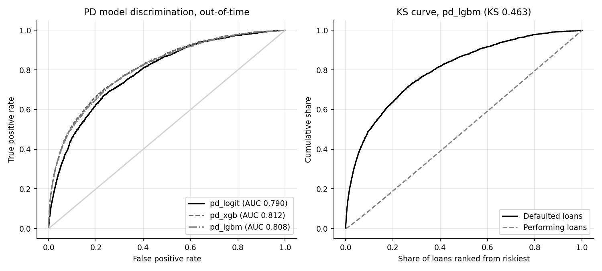{width=95%}

Three things stand out.

1. **The trees beat the scorecard, modestly and reliably.** XGBoost improves AUC by +0.0223 and LightGBM by +0.0186; the DeLong p-values (2.9e-26 and 1.1e-16) say the improvement is not noise. The simulated default hazard includes a non-linear seasoning hump and hinge-like terms (unemployment above 5, falling house prices only) that a binned linear scorecard approximates but cannot match exactly.
2. **The trees overfit more.** The training-to-OOT AUC drop is 0.022 for the scorecard, 0.036 for XGBoost and 0.076 for LightGBM. LightGBM fits the training window best and generalizes no better than XGBoost: the OOT intervals (0.788 to 0.824 for XGBoost and 0.786 to 0.823 for LightGBM) overlap almost completely. Part of every gap is not overfitting but regime change, since the OOT period contains conditions the training period lacks.
3. **Model choice is not settled by AUC alone.** The pipeline uses LightGBM for PD explanation and projection and XGBoost for prepayment (`cli.py`). A validator would reasonably ask why, given that XGBoost has the nominally higher PD AUC; the honest answer is that the two are statistically close and that this choice was a pipeline default rather than the output of a formal selection exercise.

## Discrimination in practice: deciles and lift

Sorting the out-of-time snapshots by predicted PD and cutting them into ten equal groups shows how well the score concentrates defaults at the top:

| Decile (1 = riskiest) | Loans | Defaults | Observed rate | Mean PD | Cumulative share of defaults | Lift | Gap in cumulative shares |
|:--------------------|-----:|-------:|------------:|------:|---------------------------:|---:|-----------------------:|
| 1.0 | 12,340 | 1,422 | 11.52% | 11.43% | 49.7% | 4.97 | 0.406 |
| 2.0 | 12,340 | 405 | 3.28% | 2.73% | 63.8% | 1.41 | 0.449 |
| 3.0 | 12,340 | 311 | 2.52% | 1.64% | 74.7% | 1.09 | 0.457 |
| 4.0 | 12,340 | 206 | 1.67% | 1.08% | 81.9% | 0.72 | 0.429 |
| 5.0 | 12,340 | 157 | 1.27% | 0.75% | 87.4% | 0.55 | 0.382 |
| 6.0 | 12,339 | 123 | 1.00% | 0.53% | 91.7% | 0.43 | 0.324 |
| 7.0 | 12,339 | 100 | 0.81% | 0.38% | 95.1% | 0.35 | 0.257 |
| 8.0 | 12,339 | 78 | 0.63% | 0.26% | 97.9% | 0.27 | 0.183 |
| 9.0 | 12,339 | 41 | 0.33% | 0.16% | 99.3% | 0.14 | 0.095 |
| 10.0 | 12,339 | 20 | 0.16% | 0.09% | 100.0% | 0.07 | 0.000 |

Table: LightGBM out-of-time decile table. Lift is the decile's observed rate divided by the portfolio rate; the last column is the gap between the cumulative share of defaults and of performing loans, whose maximum is the KS statistic (largest at decile 3, value 0.457).

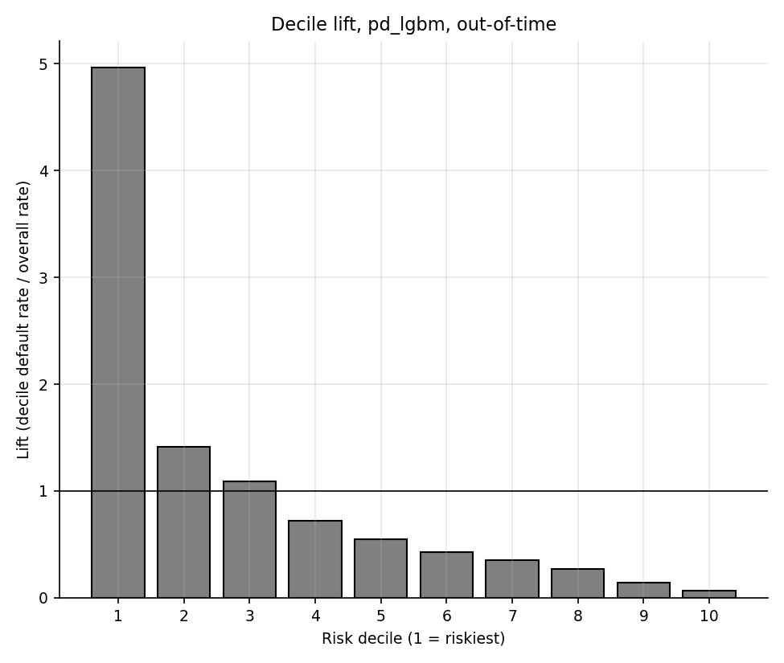{width=85%}

The riskiest decile captures 50% of all defaults at an observed rate of 11.5% (lift 4.97), and the two riskiest deciles together capture 64%. The safest decile has an observed rate of 0.16%. For comparison, the scorecard's riskiest decile captures 44% of defaults at an observed rate of 10.2%; the scorecard decile table is in `outputs/deciles_pd_pd_logit.csv`.

## Calibration

| Model | Observed rate | Mean predicted PD | Observed / predicted | Hosmer-Lemeshow | p-value (10 d.f.) |
|:--------------|------------:|----------------:|-------------------:|--------------:|----------------:|
| Scorecard logit | 2.32% | 1.74% | 1.34 | 358 | 6.7e-71 |
| XGBoost | 2.32% | 1.86% | 1.25 | 343 | 9.7e-68 |
| LightGBM | 2.32% | 1.90% | 1.22 | 368 | 6.0e-73 |

Table: Out-of-time calibration summary. The Hosmer-Lemeshow statistic is computed on ten equal-count PD bins; with this many loans it rejects any visible gap, so read the observed-to-predicted ratio.

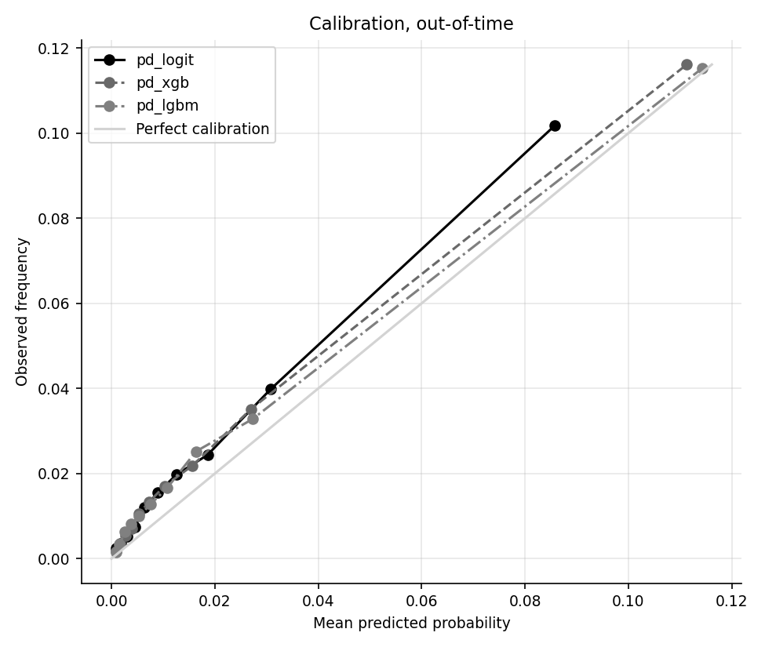{width=70%}

| Bin (low to high PD) | Loans | Mean predicted | Observed rate | Obs / pred | Expected events | Actual events |
|:-------------------|-----:|-------------:|------------:|---------:|--------------:|------------:|
| 1.0 | 12,340 | 0.089% | 0.162% | 1.83 | 11 | 20 |
| 2.0 | 12,340 | 0.158% | 0.332% | 2.11 | 19 | 41 |
| 3.0 | 12,340 | 0.256% | 0.632% | 2.47 | 32 | 78 |
| 4.0 | 12,340 | 0.381% | 0.810% | 2.13 | 47 | 100 |
| 5.0 | 12,340 | 0.535% | 0.997% | 1.86 | 66 | 123 |
| 6.0 | 12,339 | 0.752% | 1.272% | 1.69 | 93 | 157 |
| 7.0 | 12,339 | 1.083% | 1.670% | 1.54 | 134 | 206 |
| 8.0 | 12,339 | 1.636% | 2.520% | 1.54 | 202 | 311 |
| 9.0 | 12,339 | 2.733% | 3.282% | 1.20 | 337 | 405 |
| 10.0 | 12,339 | 11.427% | 11.524% | 1.01 | 1,410 | 1,422 |

Table: LightGBM calibration by bin, out-of-time.

**The models under-predict the level of default.** The out-of-time observed rate is 2.32% against a mean LightGBM prediction of 1.90% (a ratio of 1.22; XGBoost 1.25, scorecard 1.34). The top bin is almost exactly right (ratio 1.01) but the middle bins are low by a third or more (ratio 1.54 in bin 8). That pattern points to three causes that together explain the bias:

- **Calibration-window mismatch.** The calibrator is fitted on the second half of 2018 where the observed 12-month default rate is only 1.30%, against 2.00% in training and 2.32% out-of-time (3.85% for 2020 snapshots alone). A calibration map learned in a benign window carries that level forward.
- **Macro conditions outside the training range.** State unemployment in the training snapshots ranges over 4.0 to 8.6 percent but over 3.3 to 10.0 in the OOT window; trees return a constant beyond the edge of the training data, so the 2020 spike is under-weighted (section 10.4 shows the same mechanism).
- **Competing risk in the label.** Because prepayment counts as "no default", a regime with faster prepayment removes loans before they can default, and that varies by period.

This is the type of finding a model validator would flag as a finding requiring remediation (for example recalibrating on a recent window or adding a macro overlay) before the PD could be used as a level estimate. The ranking power is not affected.

## Stability by vintage and by segment

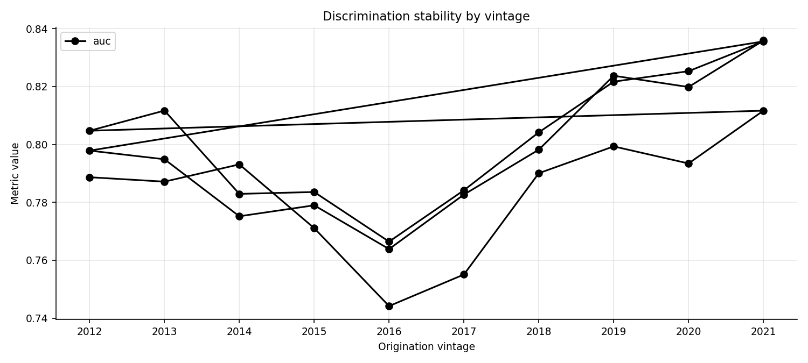{width=75%}

| Origination vintage | Snapshots | Defaults | Observed rate | Mean PD | AUC |
|:------------------|--------:|-------:|------------:|------:|----:|
| 2012.0 | 3,272 | 47 | 1.44% | 1.15% | 0.798 |
| 2013.0 | 4,120 | 69 | 1.67% | 1.29% | 0.795 |
| 2014.0 | 6,566 | 87 | 1.33% | 1.03% | 0.775 |
| 2015.0 | 5,527 | 92 | 1.66% | 1.49% | 0.779 |
| 2016.0 | 9,209 | 229 | 2.49% | 1.52% | 0.764 |
| 2017.0 | 10,894 | 283 | 2.60% | 1.88% | 0.783 |
| 2018.0 | 12,426 | 436 | 3.51% | 2.21% | 0.798 |
| 2019.0 | 22,468 | 670 | 2.98% | 2.19% | 0.824 |
| 2020.0 | 25,768 | 517 | 2.01% | 2.13% | 0.820 |
| 2021.0 | 23,145 | 433 | 1.87% | 1.93% | 0.836 |

Table: LightGBM out-of-time performance by origination vintage.

AUC ranges from 0.764 (vintage 2016) to 0.836, so ranking power is stable across vintages. Level calibration is not uniform: the observed-to-predicted ratio runs from 0.94 (vintage 2020) to 1.64 (vintage 2016), the older vintages being close to calibrated and the middle vintages that were seasoning through 2020 and 2021 being most under-predicted.

| FICO band | Loans | Defaults | Observed rate | Mean PD | Within-band AUC |
|:--------|-----:|-------:|------------:|------:|--------------:|
| <620 | 147 | 42 | 28.57% | 40.68% | 0.707 |
| 620-659 | 2,306 | 373 | 16.18% | 16.72% | 0.650 |
| 660-699 | 13,959 | 984 | 7.05% | 5.86% | 0.669 |
| 700-739 | 36,004 | 927 | 2.57% | 1.96% | 0.648 |
| 740-779 | 41,875 | 444 | 1.06% | 0.76% | 0.632 |
| 780+ | 29,104 | 93 | 0.32% | 0.22% | 0.688 |

Table: LightGBM out-of-time performance by FICO band.

The model puts the right order on the bands. Within-band AUC is lower than the overall AUC (0.632 to 0.707) because most of the overall separation comes from FICO itself. The below-620 band has only 147 snapshots and shows an observed rate of 28.6% against a predicted 40.7%, an over-prediction on a very small sample that should not be read as a pattern. The 780+ band has observed 0.32% and predicted 0.22%.

| Dimension | Segment | Loans | Observed rate | Mean PD | AUC |
|:--------|------:|------:|------------:|------:|----:|
| purpose | P | 74,208 | 2.30% | 1.92% | 0.811 |
| purpose | C | 31,079 | 2.29% | 1.90% | 0.798 |
| purpose | N | 18,108 | 2.47% | 1.86% | 0.814 |
| occupancy | O | 111,130 | 2.34% | 1.91% | 0.808 |
| occupancy | I | 7,532 | 2.18% | 1.92% | 0.800 |
| occupancy | S | 4,733 | 2.16% | 1.87% | 0.833 |

Table: LightGBM out-of-time performance by loan purpose and occupancy. The simulated default hazard has no purpose or occupancy effect, so AUCs and rates are similar across segments, as they should be.

## Population and characteristic stability

| Model | Comparison | PSI | Band |
|:--------------|-------------:|-----:|-------:|
| Scorecard logit | train vs calib | 0.1023 | moderate |
| Scorecard logit | train vs oot | 0.0118 | stable |
| XGBoost | train vs calib | 0.0798 | stable |
| XGBoost | train vs oot | 0.0062 | stable |
| LightGBM | train vs calib | 0.0774 | stable |
| LightGBM | train vs oot | 0.0087 | stable |

Table: Score PSI of each PD model, training scores against calibration-window and OOT scores.

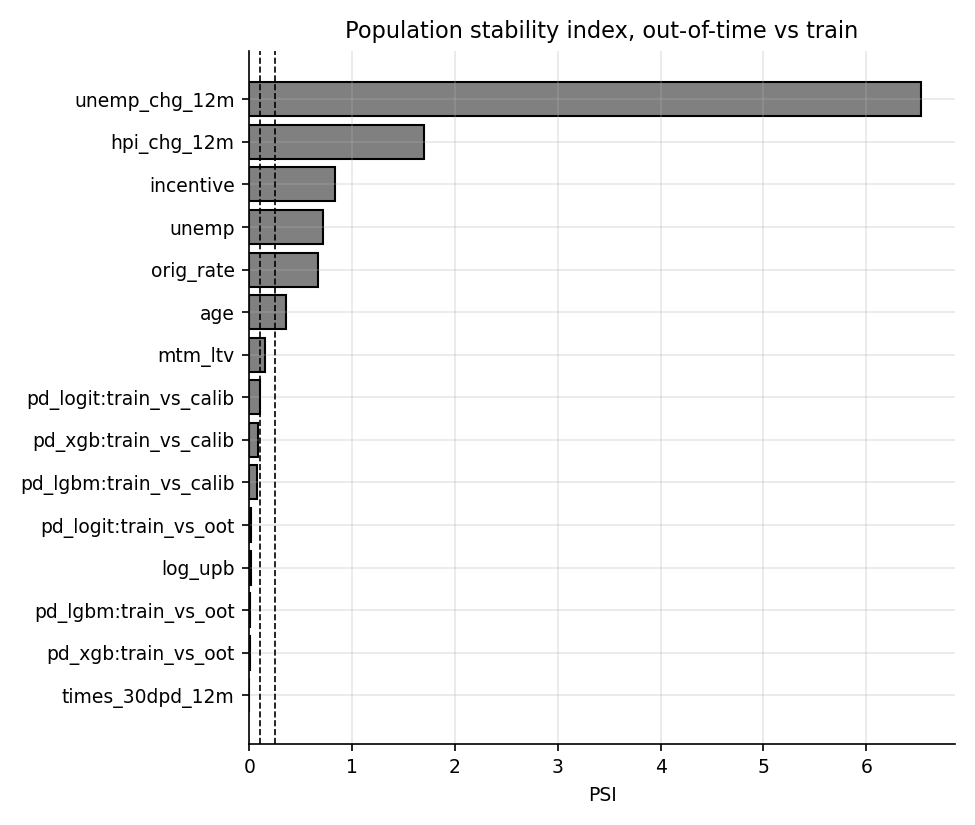{width=85%}

| Feature | CSI (OOT vs train) | Band |
|:--------------|-----------------:|----------:|
| unemp_chg_12m | 6.5340 | significant |
| hpi_chg_12m | 1.6971 | significant |
| incentive | 0.8319 | significant |
| unemp | 0.7148 | significant |
| orig_rate | 0.6714 | significant |
| age | 0.3562 | significant |
| mtm_ltv | 0.1488 | moderate |
| log_upb | 0.0116 | stable |
| times_30dpd_12m | 0.0016 | stable |
| fico | 0.0015 | stable |
| dti | 0.0010 | stable |
| state | 0.0006 | stable |
| occupancy | 0.0003 | stable |
| n_borrowers | 0.0002 | stable |
| orig_ltv | 0.0002 | stable |
| purpose | 0.0001 | stable |
| dlq_status | 0.0001 | stable |

Table: Characteristic stability index of each PD feature, out-of-time against training. 6 of 17 features are in the significant band and 1 in the moderate band.

The score distributions are stable out of time (LightGBM PSI 0.0087, XGBoost 0.0062, scorecard 0.0118), while the *inputs* drifted a lot: the macro and rate features dominate the CSI ranking (`unemp_chg_12m` (6.53), `hpi_chg_12m` (1.70), `incentive` (0.83), `unemp` (0.71)). The reason is the test design: the OOT window includes the 2020 labour market shock and the 2022 rate rise. The scorecard's PSI against the calibration window (0.1023) is in the moderate band, which an ongoing monitoring programme would investigate; the cause here is that the calibration window is a short, benign half-year. The population features borrowers choose at origination (FICO, LTV, DTI, balance) have CSI near zero, as the simulator draws every vintage from the same distribution.

The decile edges used for the scorecard PSI in the Excel workbook come from the training scores:

| Bin | Lower edge (PD) | Upper edge (PD) | Train share |
|:---|--------------:|--------------:|----------:|
| 1.0 | -inf | 0.160% | 10.00% |
| 2.0 | 0.160% | 0.271% | 10.00% |
| 3.0 | 0.271% | 0.427% | 10.00% |
| 4.0 | 0.427% | 0.616% | 10.00% |
| 5.0 | 0.616% | 0.859% | 10.00% |
| 6.0 | 0.859% | 1.205% | 10.00% |
| 7.0 | 1.205% | 1.719% | 10.00% |
| 8.0 | 1.719% | 2.664% | 10.00% |
| 9.0 | 2.664% | 4.769% | 10.00% |
| 10.0 | 4.769% | inf | 10.00% |

Table: Training-score decile bins used as the PSI baseline (`excel_inputs/psi_train_bins.csv`).

## Prepayment results

| Model | Train AUC | Calib AUC | OOT AUC | OOT AUC 95% CI | OOT Gini | OOT KS | OOT Brier | dAUC vs logit | DeLong p |
|:----------|--------:|--------:|------:|-------------:|-------:|-----:|--------:|------------:|-------:|
| Hinge logit | 0.673 | 0.652 | 0.727 | 0.701 to 0.745 | 0.455 | 0.376 | 0.0222 | baseline | n/a |
| XGBoost | 0.689 | 0.648 | 0.729 | 0.699 to 0.743 | 0.459 | 0.372 | 0.0223 | +0.0021 | 0.140 |
| LightGBM | 0.700 | 0.648 | 0.731 | 0.701 to 0.744 | 0.462 | 0.376 | 0.0223 | +0.0036 | 0.015 |

Table: Prepayment models, out-of-time on loan-month rows. The hinge logit is the baseline.

The hinge logit's out-of-time AUC is 0.727, XGBoost 0.729 and LightGBM 0.731. Only LightGBM's gain is statistically significant (p = 0.015; XGBoost p = 0.140), and it is tiny (+0.0036 AUC). That is a sensible result rather than a disappointment: the simulated monthly prepayment hazard is a smooth logistic function of the inputs, which a well-designed piecewise-linear logit already captures. Note also that out-of-time AUC (about 0.73) is *higher* than training AUC (about 0.67 to 0.70): during 2013 to 2018 the market rate barely varies relative to note rates, so incentive carries little information, whereas 2020 to 2022 contains a large rate swing that makes incentive highly informative.

The hinge logit coefficients and the slope each segment of the incentive implies:

| Term | Coefficient | Knot (pp) |
|:-------------|----------:|--------:|
| const | -7.3564 |  |
| hinge_0.0 | 2.9007 | 0.0 |
| hinge_0.5 | -1.1730 | 0.5 |
| hinge_1.0 | -2.0790 | 1.0 |
| hinge_1.5 | 0.8237 | 1.5 |
| burnout | -0.0337 |  |
| seasoning_ramp | 0.7983 |  |
| mtm_ltv | -0.0025 |  |
| fico | 0.0032 |  |

Table: Hinge logit coefficients (statsmodels).

| Rate incentive (pp) | Slope of log-odds per pp |
|:-----------------------------------|-----------------------:|
| Incentive below 0 (out of the money) | 0.000 |
| 0 to 0.5 | 2.901 |
| 0.5 to 1.0 | 1.728 |
| 1.0 to 1.5 | -0.351 |
| Above 1.5 | 0.472 |

Table: Slope of the prepay log-odds with respect to incentive, accumulated from the hinge terms.

The slope is zero when the incentive is negative (the pool is out of the money and prepayment is only turnover), then rises to 2.90 per percentage point between 0 and 0.5, 1.73 between 0.5 and 1, and flattens at larger incentives (-0.35 and 0.47) as the S-shape saturates. Burnout has a coefficient of -0.0337 per month (negative, as designed), the seasoning ramp 0.798, MTM LTV -0.0025 per point and FICO 0.0032 per point.

At the portfolio level, the LightGBM prediction follows the annualized CPR over time:

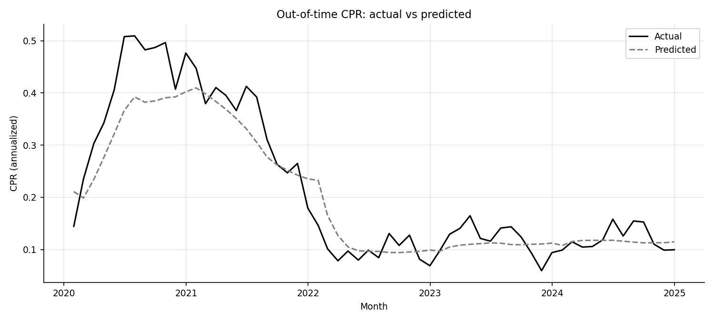{width=90%}

| Calendar year | Actual mean CPR | Predicted mean CPR (LightGBM) | Predicted minus actual |
|:------------|--------------:|----------------------------:|---------------------:|
| 2020.0 | 40.0% | 32.9% | -7.0 pp |
| 2021.0 | 33.9% | 31.8% | -2.1 pp |
| 2022.0 | 10.0% | 11.7% | +1.6 pp |
| 2023.0 | 11.9% | 10.9% | -1.0 pp |
| 2024.0 | 12.0% | 11.5% | -0.5 pp |

Table: Average annualized CPR by year, actual against LightGBM predicted.

The monthly root-mean-square error of CPR is 4.99 points for LightGBM, 5.17 for XGBoost and 4.74 for the hinge logit. The actual peak of 50.9% in 2020-07 is predicted as 39.2%: the model captures the wave but not its full height, and it responds a little late to the end of the wave in early 2022. In 2023 the actual average is 11.9% against a predicted 10.9%. The hinge logit has the lowest CPR error of the three, so it would be a defensible champion for prepayment projections on this evidence, even though XGBoost is wired into the scenario engine.

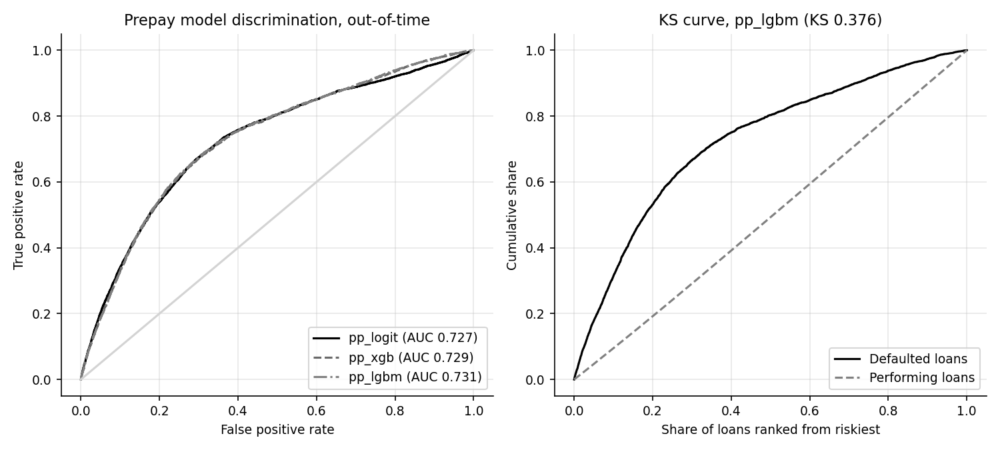{width=90%}

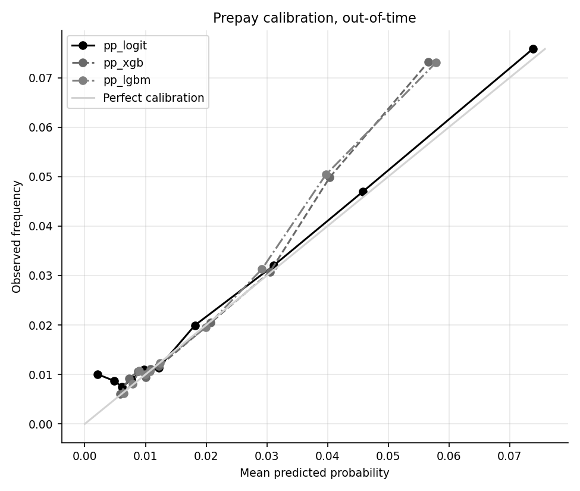{width=65%}

# Explainability

## Global importance

SHAP values (section 7.12) were computed for the LightGBM PD model and the XGBoost prepayment model on random out-of-time samples.

| Rank | Feature | Mean absolute SHAP (log-odds) |
|:---|------------:|----------------------------:|
| 1 | fico | 0.8104 |
| 2 | dti | 0.2179 |
| 3 | unemp | 0.1887 |
| 4 | age | 0.1374 |
| 5 | mtm_ltv | 0.0918 |
| 6 | unemp_chg_12m | 0.0688 |
| 7 | orig_rate | 0.0635 |
| 8 | incentive | 0.0579 |
| 9 | dlq_status | 0.0541 |
| 10 | log_upb | 0.0529 |

Table: Top ten PD features by mean absolute SHAP value (log-odds units).

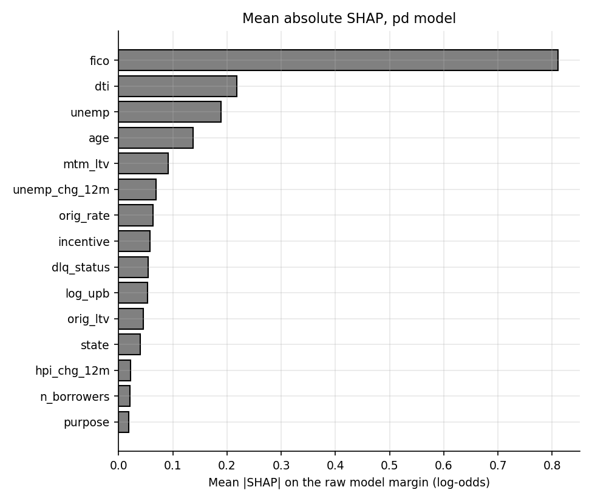{width=70%}

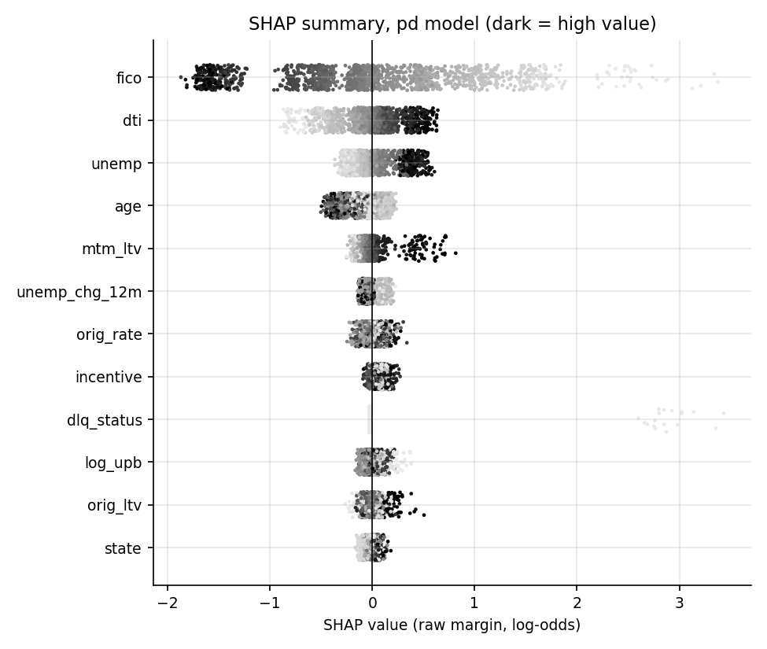{width=80%}

`fico` dominates (0.810), followed by `dti`, `unemp`, `age` and `mtm_ltv`. The beeswarm shows the direction: low FICO (light dots) pushes the log-odds up and high FICO pushes it down; high DTI, high unemployment and high mark-to-market LTV push it up; older age pulls it down in the simulated hump. One subtlety: `dlq_status` ranks 9 with a mean absolute SHAP of only 0.054, yet in the beeswarm the few loans that are currently 30DPD receive a contribution of about +3 log-odds. Mean absolute SHAP averages over all loans, and only about 0.84% of snapshots are delinquent, so a rare feature can be decisive for the loans it touches and still rank low globally.

| Rank | Feature | Mean absolute SHAP (log-odds) |
|:---|-------------:|----------------------------:|
| 1 | incentive | 0.6539 |
| 2 | age | 0.1380 |
| 3 | burnout | 0.0993 |
| 4 | fico | 0.0837 |
| 5 | log_upb | 0.0582 |
| 6 | seasoning_ramp | 0.0331 |
| 7 | month_of_year | 0.0236 |
| 8 | mtm_ltv | 0.0217 |
| 9 | dti | 0.0098 |
| 10 | state | 0.0031 |

Table: Top ten prepayment features by mean absolute SHAP value.

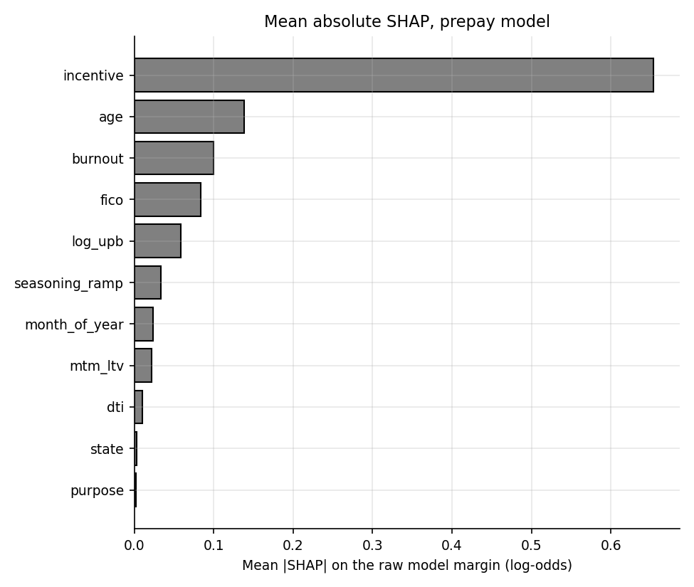{width=70%}

For prepayment, `incentive` alone carries 58% of the total importance, followed by `age`, `burnout` and `fico`. This is what the simulated hazard implies: the refinance term is the biggest lever, with age/seasoning and burnout the next.

## Alignment with the data generating process

A check that explanations make sense is only possible here because the truth is known. `explain.dgp_alignment` runs two kinds of test. The *rank* tests ask whether the features the DGP says matter most appear near the top of the SHAP ranking (for PD: FICO, mark-to-market LTV and unemployment in the top five, and DTI or recent delinquencies also in the top five; for prepay: incentive first, burnout in the top four). The *sign* tests compute the Spearman rank correlation between a feature's value and its SHAP value and require its sign to match the DGP coefficient with absolute value of at least 0.05.

| Model | Feature | DGP-implied expectation | SHAP rank | Result |
|:-----|------------------:|----------------------:|--------:|-----:|
| PD | fico | top 5 | 1 | pass |
| PD | mtm_ltv | top 5 | 5 | pass |
| PD | unemp | top 5 | 3 | pass |
| PD | dti/times_30dpd_12m | either in top 5 | 2 | pass |
| PD | fico | sign - | 1 | pass |
| PD | mtm_ltv | sign + | 5 | pass |
| PD | unemp | sign + | 3 | pass |
| PD | dti | sign + | 2 | pass |
| Prepay | incentive | rank 1 | 1 | pass |
| Prepay | burnout | top 4 | 3 | pass |
| Prepay | incentive | sign + | 1 | pass |
| Prepay | burnout | sign - | 3 | pass |
| Prepay | fico | sign + | 4 | pass |

Table: DGP alignment checks. 13 of 13 pass.

Passing these checks shows that the trees learned the right structure and that the SHAP pipeline is wired correctly. It does not show that the same relationships hold in real data, where no such truth exists.

## Dependence plots

Dependence plots show, for one feature, the SHAP contribution of each loan against that feature's value. They reveal the *shape* of the learned relationship, including thresholds and flat regions.

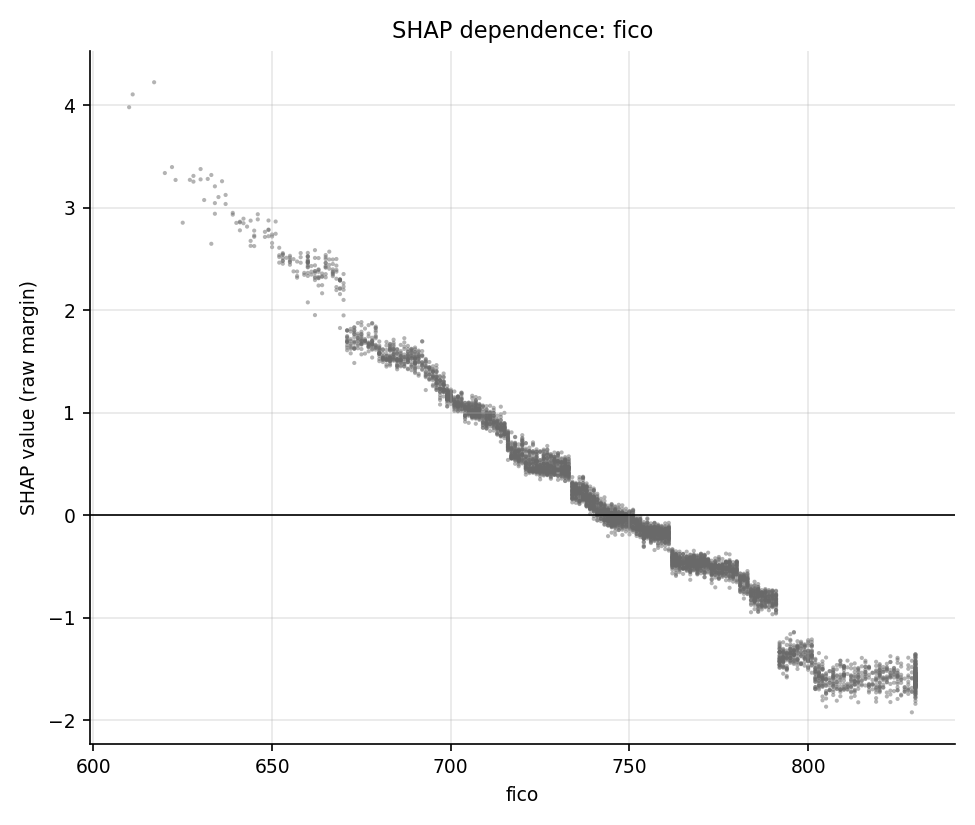{width=65%}

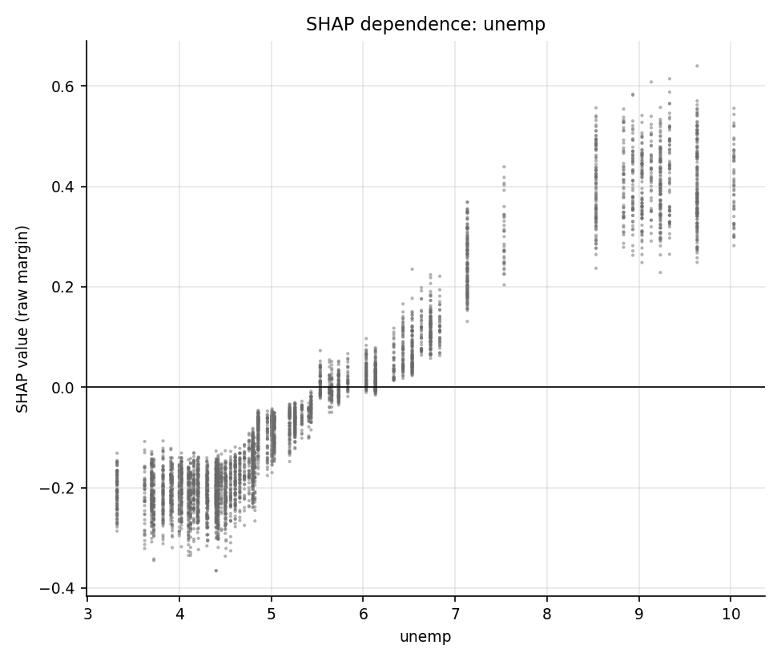{width=65%}

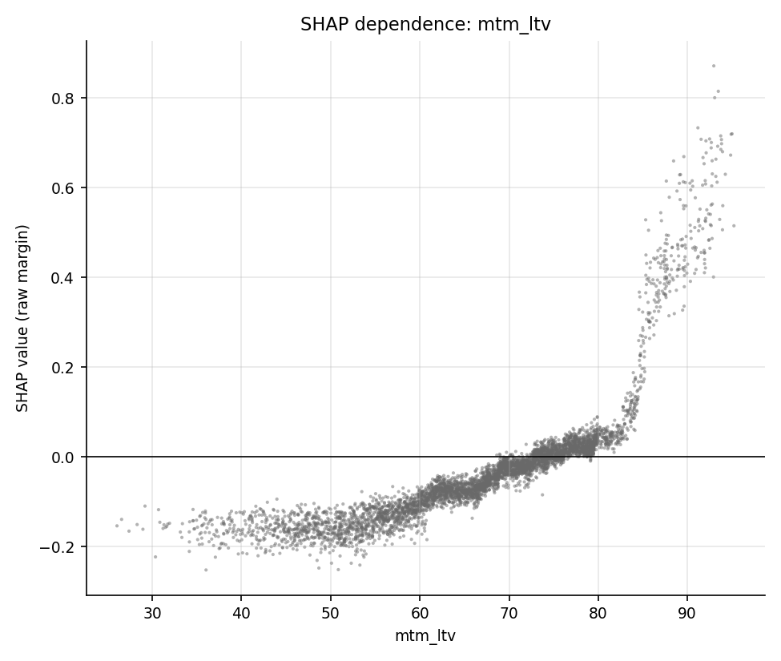{width=65%}

The FICO plot is monotone decreasing, as constrained. The unemployment plot is the instructive one: the contribution climbs steeply between 5 and 7 percent, then **goes flat above about 8.5 percent**, which is the edge of the unemployment range seen in training (training maximum 8.6, OOT maximum 10.0). The true hazard keeps rising linearly with unemployment; the model cannot, and this is the root of the stress under-reaction in section 10.4. The plots for age, DTI and 12-month unemployment change, and the prepayment dependence plots (incentive, age, burnout), are in `outputs/charts/`.

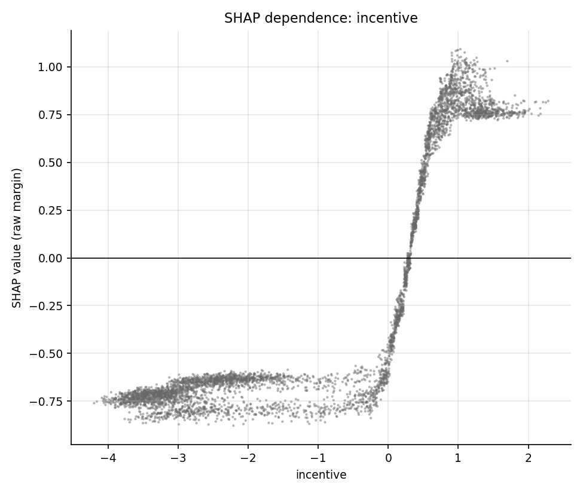{width=65%}

## Reason codes for individual loans

`explain.reason_codes` turns a loan's SHAP vector into plain-language reasons: the features with the largest **positive** (risk-increasing) contributions are mapped through `config.REASON_TEXT`, so a loan receives up to four reasons such as "Credit score lower than typical". `explain.reason_code_table` applies this to five illustrative out-of-time loans.

| Case | Loan | PD | Reason 1 | Reason 2 | Reason 3 | Reason 4 |
|:--------------------|----:|-----:|------------------------------:|--------------------------:|--------------------------:|--------------------------:|
| lowest pd | 46489 | 0.03% | Elevated risk from occupancy | Recent 30-day delinquencies | Falling home prices | Elevated risk from purpose |
| median pd | 6423 | 0.63% | High debt-to-income | Rate incentive | High note rate | High original loan-to-value |
| highest pd | 7975 | 95.59% | Credit score lower than typical | Currently delinquent | High debt-to-income | High note rate |
| currently 30dpd | 7975 | 95.59% | Credit score lower than typical | Currently delinquent | High debt-to-income | High note rate |
| high prepay incentive | 10258 | 4.92% | Credit score lower than typical | High note rate | Elevated local unemployment | Rate incentive |

Table: Reason codes for illustrative loans (LightGBM PD model).

For the riskiest loan (PD 95.6%) the reasons are sensible: low credit score, currently delinquent, high DTI and a high note rate. The lowest-risk loan (PD 0.029%) shows the limitation of the method: the "reasons" are simply the least favourable features of a loan that has none, with tiny contributions (for example "Elevated risk from occupancy", the generic text for features without a mapped phrase). A production adverse-action process would only report reasons above a materiality threshold. The "currently 30DPD" case is the same loan as the highest-PD case because that loan is both.

# Scenario analysis

## The six shocks

A scenario is a deterministic macro path applied to the end-2023 portfolio. `macro.apply_shock` ramps each shock linearly over the stated number of months from the as-of date and then holds it constant.

| Scenario | Rate shock (bp) | House prices | Unemployment (pts) | Ramp (months) |
|:----------------|--------------:|-----------:|-----------------:|------------:|
| Base | 0 | 0 | 0 | 12 |
| Rates +200bp | +200 | 0 | 0 | 12 |
| Rates -200bp | -200 | 0 | 0 | 12 |
| HPI -20% | 0 | -20% | 0 | 12 |
| Unemployment +4pt | 0 | 0 | +4 | 12 |
| Adverse combined | +200 | -20% | +4 | 12 |

Table: Scenario definitions (`config.SHOCKS`). Rates are added to the market mortgage rate, house prices are scaled multiplicatively, and unemployment points are added to every state's rate.

## How the projection works

*Intuition.* Take every loan alive at the as-of date, move the calendar forward one month at a time, update each loan's inputs for the shocked macro world (age plus one, scheduled amortization, new rate incentive, new mark-to-market LTV, new unemployment), re-score it with both models, and aggregate the expected defaults and prepayments weighted by balance.

*Maths.* In projection month $k$, for loan $i$ with exposure $E_{i,k}$ (survival weight times scheduled balance), the 12-month PD is converted to a monthly default hazard,

$$\text{hd}_{i,k} = 1-\big(1-\text{PD}^{12}_{i,k}\big)^{1/12},$$

(capped at 0.5), applied first. The prepayment SMM $s_{i,k}$ is then applied to the loans that survived the default step and are in the current state at the as-of date. Expected defaulted and prepaid balances are

$$D_k=\sum_i E_{i,k}\,\text{hd}_{i,k}, \qquad P_k=\sum_i \big(E_{i,k}-E_{i,k}\text{hd}_{i,k}\big)\,s_{i,k},$$

and the survival weight is updated as $w_{i,k+1}=w_{i,k}(1-\text{hd}_{i,k})(1-s_{i,k})$. The portfolio monthly default rate (MDR) and SMM are $D_k/\sum_i E_{i,k}$ and $P_k/(\sum_i E_{i,k}-D_k)$, and the annualized CDR and CPR follow from $1-(1-x)^{12}$.

*Implementation.* `scenarios.project_portfolio` (model-based), built on a helper `_Path` that precomputes each loan's shocked inputs for every month, and `scenarios.project_truth` (the DGP's own Markov chain evaluated under the same shocked macro, synthetic data only). The models used are LightGBM for PD and XGBoost for prepayment. The 60-month curves are in `outputs/scenario_curves.csv` and the 12-month summary in `outputs/scenario_12m.csv`.

Important simplifications, all documented in the module header: delinquency status and the recent-delinquency count are held at their as-of values; only loans that were current at the as-of date are allowed to prepay; and the default step uses a 12-month cumulative-incidence PD as a monthly hazard on a portfolio that is also prepaying, which slightly double counts the removal of loans (section 10.5).

## Results on the end-2023 pool

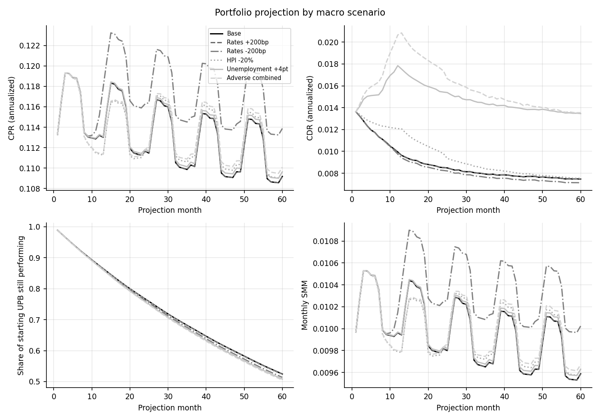{width=95%}

| Scenario | 12m defaults (% of starting UPB) | 12m prepayments (% of starting UPB) | Average CPR, months 1 to 12 | Average CDR, months 1 to 12 |
|:----------------|-------------------------------:|----------------------------------:|--------------------------:|--------------------------:|
| Base | 1.092 | 11.38 | 11.58% | 1.163% |
| Rates +200bp | 1.092 | 11.38 | 11.58% | 1.163% |
| Rates -200bp | 1.089 | 11.40 | 11.60% | 1.159% |
| HPI -20% | 1.184 | 11.33 | 11.53% | 1.263% |
| Unemployment +4pt | 1.454 | 11.37 | 11.58% | 1.559% |
| Adverse combined | 1.564 | 11.31 | 11.53% | 1.680% |

Table: Twelve-month summary on the 31 December 2023 pool, model-based. Defaults and prepayments are percentages of the starting balance.

**Unemployment and house prices move defaults; rates do not move anything.** The unemployment shock raises the model's 12-month default rate from 1.09% to 1.45% (an increase of 33%); the house-price shock to 1.18%; the combined adverse scenario to 1.56% (1.43 times base). The two rate scenarios are almost indistinguishable from base: the +200bp 12-month default and prepayment rates are identical to base to the displayed precision, while -200bp changes 12-month prepayments by only 0.025 percentage points.

The reason is **moneyness**. The pool at the end of 2023 holds 11,947 loans with a balance of USD 2,645 million. Its balance-weighted note rate is 3.59 percent against a simulated market rate of 6.8 percent, a balance-weighted incentive of -3.21 points, and only 0.0% of the balance has an incentive above 0.5 points. In that region the refinance sigmoid is flat at zero, so a +200bp shock moves loans from very negative incentive to even more negative with no effect, and even -200bp only brings the market rate to 4.8 percent, still above the note rate of most loans. A pool this far out of the money has almost no rate sensitivity, which is a true economic fact about such pools (the 2022 to 2023 "lock-in" effect) and not a software defect. To see the rate sensitivity the model does have, the pipeline repeats the whole scenario run for a pool as of 31 December 2021, when the balance-weighted incentive was 0.52 points and 45.0% of the balance was in the money.

The in-the-money run (as-of 31 December 2021, when the pool was close to the market rate) is written to `outputs/scenarios_itm_2021/`.

| Scenario | 12m defaults (% of UPB) | 12m prepayments (% of UPB) | Average CPR | Average CDR |
|:----------------|----------------------:|-------------------------:|----------:|----------:|
| Base | 1.640 | 11.57 | 11.64% | 1.764% |
| Rates +200bp | 1.646 | 11.14 | 11.21% | 1.764% |
| Rates -200bp | 1.627 | 12.77 | 12.85% | 1.763% |
| HPI -20% | 1.885 | 11.21 | 11.26% | 2.035% |
| Unemployment +4pt | 2.030 | 11.56 | 11.65% | 2.198% |
| Adverse combined | 2.349 | 10.76 | 10.84% | 2.538% |

Table: Twelve-month scenario summary, pool as of 31 December 2021.

Here the base average CPR over the first twelve months is 11.6%, it rises to 12.9% (1.10 times base) when rates fall 200bp and drops to 11.2% (0.96 times base) when they rise 200bp. This is the behaviour the end-2023 pool cannot show.

| Scenario | Model default | Truth default | Default error | Model prepay | Truth prepay | Prepay error |
|:----------------|------------:|------------:|------------:|-----------:|-----------:|-----------:|
| Base | 1.64 | 1.63 | +1% | 11.57 | 10.30 | +12% |
| Rates +200bp | 1.65 | 1.63 | +1% | 11.14 | 10.01 | +11% |
| Rates -200bp | 1.63 | 1.62 | +1% | 12.77 | 11.15 | +15% |
| HPI -20% | 1.89 | 3.03 | -38% | 11.21 | 10.25 | +9% |
| Unemployment +4pt | 2.03 | 2.74 | -26% | 11.56 | 10.23 | +13% |
| Adverse combined | 2.35 | 5.62 | -58% | 10.76 | 9.83 | +9% |

Table: Model versus simulation truth, pool as of 31 December 2021.

In this pool the model agrees with simulation truth on the base 12-month default rate (error +1%), so the base-case bias at end-2023 is a feature of that pool, but the model still under-reacts to stress (house prices -38%, combined -58%), and it over-predicts base prepayment by +12%, which is a level error to be aware of when using the rate sensitivity.

## Model against simulation truth

Because the simulator has an exact DGP, the scenario engine can be compared with a "truth" projection that evaluates the true hazards (and the true 30, 60 and 90 day roll chain) on the same shocked paths. This is a **methodology check specific to synthetic data**; it has no analogue on real data.

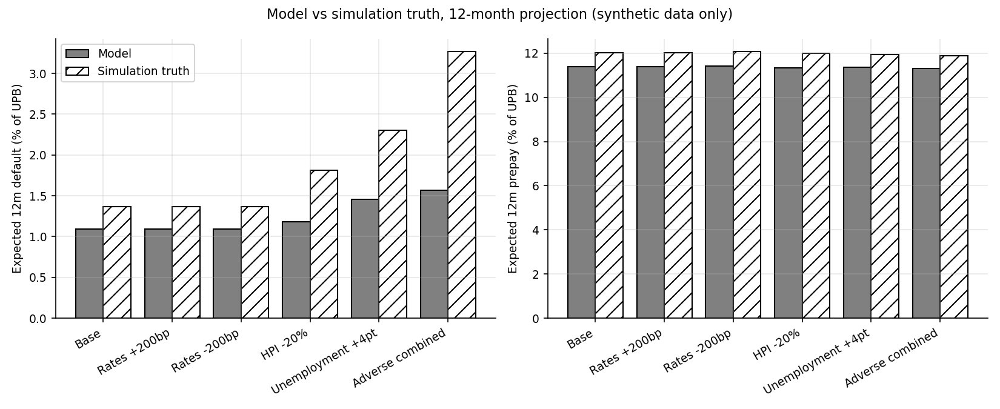{width=95%}

| Scenario | Model default | Truth default | Default error | Model prepay | Truth prepay | Prepay error |
|:----------------|------------:|------------:|------------:|-----------:|-----------:|-----------:|
| Base | 1.09 | 1.37 | -20% | 11.38 | 12.02 | -5% |
| Rates +200bp | 1.09 | 1.37 | -20% | 11.38 | 12.02 | -5% |
| Rates -200bp | 1.09 | 1.37 | -21% | 11.40 | 12.06 | -5% |
| HPI -20% | 1.18 | 1.81 | -35% | 11.33 | 11.99 | -6% |
| Unemployment +4pt | 1.45 | 2.30 | -37% | 11.37 | 11.95 | -5% |
| Adverse combined | 1.56 | 3.26 | -52% | 11.31 | 11.88 | -5% |

Table: Model against simulation truth, 12 months, percent of starting balance. Errors are model divided by truth minus one.

Prepayments are within about ten percent of truth in every scenario (errors of -5% in the base case and -5% in the adverse case). **Defaults are not.** In the base case the model is -20% below truth (1.09% against 1.37%), which is inside the project's own tolerance of 25%, but the shortfall widens with stress: -35% for house prices, -37% for unemployment and -52% for the combined scenario (1.56% against 3.26%). In total 3 of the six scenarios exceed the 25% tolerance. Under unemployment +4 points the truth rises by 68% and the model by 33%; under the combined scenario the truth is 2.38 times base and the model only 1.43 times.

**Why the model under-reacts: trees cannot extrapolate.** A tree-based model is a piecewise-constant function of its inputs; outside the range seen in training, its output is whatever the outermost leaf says, even though the underlying true relationship continues. The stress scenarios push the inputs beyond that range. In training, the 12-month house price change never fell below 3.5% (the full range was 3.5% to 7.3%), so the model has no information about falling prices, yet the DGP adds default risk precisely when prices fall; the HPI -20% scenario therefore sits entirely in unseen territory. Similarly, unemployment in training peaked at 8.6 percent while the +4 point shock moves state rates toward and past that level. Monotone constraints keep the response non-decreasing but do not add slope where the data have none. The base-case error is pool specific rather than a constant bias. For the end-2023 pool it is -20%; for the 2021 pool in section 10.3 it is only +1%, whereas the stress errors persist there (-38% for house prices and -58% for the combined scenario). The end-2023 pool is dominated by seasoned, low-PD loans, which is exactly where the observed-to-predicted calibration ratio is largest (up to 2.47 in bin 3 of section 8.3), so the same calibration weakness shows up as a larger relative error. Two smaller sources apply to every pool: the frozen delinquency status and the use of a cumulative-incidence PD as a hazard.

The practical lesson, which a validator would write up as a limitation, is that a loan-level tree model is a reasonable *baseline* projection engine inside the historical range and should not be used alone for severe stress tests. Remedies include adding an explicit macro overlay or a parametric hazard layer for the stress dimension, training on data that spans a full cycle (real data would include 2008 to 2012), or blending with the logistic scorecard whose linear terms do extrapolate.

## Limits of the projection

Besides extrapolation, the following limits apply: scenarios are deterministic linear ramps, not draws from a joint macro distribution, so no probability can be attached to them; status is frozen during the projection, so a loan that is current at the as-of date cannot become delinquent and then cure within the model-based path; loss severity is not modelled; the PD already nets out prepayment (cumulative incidence) and is then applied together with a separate prepayment step, which double counts the removal of loans and biases the default projection downward by roughly the prepayment rate times the default rate; and the result is one realization of one simulated portfolio, with no uncertainty bands from re-simulating the data.

## Waterfall export hook

`export_hook.write_curves` converts each scenario's projected curve into the two files read by the securitization waterfall project.

**`cpr_cdr_curves.csv`** contains monthly vectors for each scenario for 120 months (the 60 modelled months are extended by holding the last SMM and MDR flat):

| scenario | month | smm | mdr | cpr_annual | cdr_annual | survival |
|:-------|----:|-----:|-----:|---------:|---------:|-------:|
| Base | 1 | 0.997% | 0.114% | 11.33% | 1.363% | 98.9% |
| Base | 12 | 0.996% | 0.083% | 11.32% | 0.994% | 87.4% |
| Base | 60 | 0.959% | 0.062% | 10.92% | 0.747% | 52.4% |
| Base | 61 | 0.959% | 0.062% | 10.92% | 0.747% | 51.9% |
| Base | 120 | 0.959% | 0.062% | 10.92% | 0.747% | 28.3% |

Table: Base scenario curve extract (months 1, 12, 60, 61 and 120). Month 61 onward repeats the month-60 rates.

**`scalar_equivalents.csv`** summarizes each scenario with one set of scalar assumptions, using survival-balance weights on the annualized rates:

| name | cpr | cdr | severity | lag | index_shift |
|:----------------|-----:|-----:|-------:|--:|----------:|
| Base | 11.21% | 0.852% | 0.35 | 6 | 0.0000 |
| Rates +200bp | 11.21% | 0.852% | 0.35 | 6 | +0.0200 |
| Rates -200bp | 11.61% | 0.827% | 0.35 | 6 | -0.0200 |
| HPI -20% | 11.23% | 0.911% | 0.35 | 6 | 0.0000 |
| Unemployment +4pt | 11.25% | 1.449% | 0.35 | 6 | 0.0000 |
| Adverse combined | 11.26% | 1.530% | 0.35 | 6 | +0.0200 |

Table: Scalar equivalents. Column names equal the fields of `waterfall.config.Scenario`.

| Hook column | Waterfall `Scenario` field | Meaning and unit |
|:--|:--|:--|
| `scenario` | `name` | scenario label |
| `cpr` | `cpr` | annualized prepayment rate, decimal |
| `cdr` | `cdr` | annualized default rate, decimal |
| `severity` | `severity` | loss given default, fixed assumption 0.35 |
| `lag` | `lag` | months from default to recovery, fixed assumption 6 |
| `index_shift` | `index_shift` | parallel shift of the floating index, decimal (rate shock bp divided by 10,000) |

Table: Mapping of the exported scalars to the waterfall project's `Scenario` dataclass.

`export_hook.to_waterfall_scenarios` reads the scalar file back into dictionaries with exactly these keys, and a test compares the keys with the sibling project's `config.py` so the interface cannot drift silently. Two caveats. Severity and lag are assumptions, not model outputs. And the sibling project's collateral is a synthetic short-maturity, high-coupon consumer-style pool, with a base scenario of 10 percent CPR and 3 percent CDR, whereas this project's base mortgage pool shows a CPR of 11.21% and a CDR of only 0.852% (1.530% in the adverse combined case). The hook therefore demonstrates the interface and units; applying mortgage-derived CDRs to a different collateral type would not be a meaningful deal analysis.

# Excel workbook walkthrough

## Why an Excel version exists

Model validators and credit committees often want to see a calculation in a tool they can audit cell by cell. The workbook `excel/mortgage_risk_model.xlsx` re-implements the scorecard, the decile and calibration analysis, the PSI and a simplified scenario engine with **live formulas** over a fixed sample of 2,000 out-of-time snapshot loans (`excel_inputs/loan_sample.csv`, a seeded random draw from the out-of-time set). The workbook contains 62,535 formulas. It is generated by `excel/build_workbook.py`, with the Python-side reference values and the comparison logic in `mortgage_risk/reconcile_excel.py`. Typed numbers are limited to the Inputs sheet and to imported Python value sheets; everything else is a formula.

## Sheet by sheet

| Sheet | What it contains | Live or static |
|:--|:--|:--|
| README | purpose, how to use, list of approximations | text |
| Inputs | scenario selector (1 to 6), LGD, scorecard scaling (PDO, base score, base odds; factor and offset are formulas), the logit intercept, Platt calibrator slope and intercept, prepay hinge coefficients, a one-loan calculator input block | inputs; factor and offset live |
| Scorecard | the bin table from `scorecard_table.csv` (variable, bin edges, WoE, coefficient, points) with a helper column of finite edges | static values from Python |
| Score_Calc | one-loan scorecard calculator: looks up each variable's bin, WoE and points from the Inputs block, sums to a margin, calibrated PD and total score, and ranks the three variables with the largest shortfall against the best bin | live |
| Loan_Sample | the 2,000 loans with their attributes and the Python scorecard PD, points and LightGBM PD (static), plus live columns for each variable's WoE, the margin, the calibrated PD, the points, the PD rank and the decile | static attributes, live `xl_` columns |
| Deciles | ten equal-count groups on the live PD: counts, events, rate, mean PD, cumulative capture, lift, KS gap, a trapezoid AUC and Gini, next to the full-population Python decile values | live |
| PSI | the training decile bins (from `psi_train_bins.csv`) against the live sample score shares, with the share floor and bands; total PSI | live |
| Calibration | predicted against observed by decile, Brier score against a constant-forecast Brier, Hosmer-Lemeshow, expected against observed events | live |
| Scenario | the selected shock applied to the sample (unemployment added, MTM LTV divided by one plus the HPI shock, incentive reduced by the rate shock), re-binned scorecard PD, expected loss as PD times LGD times balance, and prepay SMM from the hinge logit; base against selected; Python GBM reference below | live |
| Checks | 14 integrity checks (counts, bounds, rank permutation, shares sum to one, live PD and points against the exported Python values) and an all-pass cell | live |
| Conclusions | static text written by the builder from the computed numbers | text |
| Python_Ref | imported Python benchmark, decile, PSI bins, CSI and scenario summary tables used for side-by-side comparison | static values |
| Curves_Python | the 60-month Python scenario curves (`scenario_curves.csv`) | static values |

Table: Workbook sheets.

Three mechanics deserve explanation. First, a bin lookup: for a value $x$ and a variable's finite bin edges $e_1<\dots<e_{k-1}$, the bin number is one plus the count of edges strictly below $x$, i.e. `SUMPRODUCT(--(edges<x))+1`, which reproduces the right-closed bins of `BinSpec.bin_index`; a blank input falls into the "missing" bin. Second, the calibrated PD in Excel applies the stored Platt slope $a=1.0661$ and intercept $b=0.2036$ to the scorecard margin $z$, $p=\sigma(az+b)$, clipped to $[10^{-6}, 1-10^{-6}]$, mirroring the Python calibrator for the scorecard. Third, the rank and decile columns replicate `evaluation.decile_table`: sorted by descending PD with ties broken by input order (a `COUNTIF` tiebreak on rank), with the remainder loans going to the first groups as in `numpy.array_split`.

## Approximations the workbook makes on purpose

- **Prepay burnout.** The sample has no burnout history, so the prepay hinge logit uses a single burnout value of 36.4 months, solved so that the sample's base 12-month prepay equals the Python GBM base. This is labelled an approximation on the Inputs sheet.
- **Scenario step.** The full shock is applied at the snapshot with no ramp, and prepay is annualized at a constant SMM, so the Excel scenario table is not comparable with the 60-month Python projection; the Python reference values are shown beside it for context only.
- **Rate shocks.** The scorecard moves with a rate shock only through its `incentive` variable, while the hinge logit moves a great deal, so Excel rate scenarios mainly demonstrate the mechanics.
- **AUC and Gini.** Computed from the decile ROC trapezoid, an approximation of the exact AUC.

## Reconciliation to Python

`mortgage_risk/reconcile_excel.py` rebuilds the workbook, recalculates it headlessly in LibreOffice, reads the results back and compares each quantity with an independent Python computation. It runs 6 scenario cases (Base (selector 1, passed), Rates +200bp (selector 2, passed), Rates -200bp (selector 3, passed), HPI -20% (selector 4, passed), Unemployment +4pt (selector 5, passed), Adverse combined (selector 6, passed)). Overall result: **all comparisons passed**; the report recorded 62,535 formulas and a run time of 43.4 seconds. The largest absolute difference across all quantities is 3.1e-05 (`vs_exported_python_points`); every quantity computed from the same inputs agrees to better than 1e-8 except the comparison with the values Python exported to the CSV, which is limited by the float32 precision at which the loan attributes are stored.

| Quantity | Worst absolute difference, Excel against Python |
|:---------------------------------------|---------------------------------------:|
| Calibrated scorecard PD, each of the sample loans | 4.6e-16 |
| Scorecard points, each loan | 6.8e-13 |
| PD rank, each loan | 0.0e+00 |
| Decile assignment, each loan | 0.0e+00 |
| Excel PD against the PD stored by Python in loan_sample.csv | 1.1e-08 |
| Excel points against the points stored by Python | 3.1e-05 |
| Decile loan counts | 0.0e+00 |
| Decile event counts | 0.0e+00 |
| Decile mean PD | 6.9e-17 |
| Decile lift | 4.2e-15 |
| KS statistic | 3.3e-16 |
| Approximate AUC (decile ROC trapezoid) | 0.0e+00 |
| Total PSI | 2.1e-17 |
| Brier score | 4.9e-17 |
| Hosmer-Lemeshow statistic | 6.4e-14 |
| Expected events | 8.5e-14 |
| Scenario expected defaults | 7.8e-14 |
| Scenario expected loss (USD) | 6.5e-09 |
| Scenario 12-month prepay | 1.5e-15 |
| One-loan calculator PD | 1.9e-17 |
| One-loan calculator score | 1.1e-13 |

Table: Excel reconciliation, worst absolute difference over the cases (from `outputs/excel_reconciliation.json`).

The differences of order 1e-13 to 1e-16 are floating-point rounding. They show that the live formulas reproduce the Python scorecard, decile, PSI, calibration and scenario logic, which is the purpose of the exercise: a reviewer can trace any number in the workbook to a cell formula and know it matches the code. They say nothing about whether the model is right for real loans.

# Governance in the style of SR 11-7

Supervisory guidance on model risk management, issued by the Federal Reserve and the OCC in 2011 as SR 11-7, asks banks to document a model's purpose, design, data, performance, limitations and ongoing monitoring, to validate it independently with "effective challenge", and to keep an inventory and controls (Federal Reserve and OCC 2011). This section writes the project up in that structure to show how such a model would be described. **It is a documentation exercise on synthetic data. The model has not been independently validated, has not been approved by any institution, and must not be used to make credit, pricing or capital decisions.**

## Purpose and intended use

The models estimate (a) the 12-month probability that a performing or early-delinquent first-lien 30-year mortgage reaches 90+DPD and (b) the monthly probability of full prepayment, for ranking loans, producing expected default and prepayment curves for a pool under macro scenarios, and feeding those curves into a structured-finance cash-flow model. Intended users are an analyst learning the workflow and a reader assessing methodology. Out-of-scope uses: severity or loss forecasting, regulatory capital, accounting provisioning, origination decisions, pricing of real securities, or any use on loan types other than the simulated 30-year fixed-rate first liens.

## Data

Synthetic panel of 60,000 loans (seed 20261001) generated by a documented process (section 4). Real-data readiness: the loader for Freddie Mac loan-level files exists and is exercised only by unit tests on a small fixture, not on full vintages. Data quality controls: stop at first default event, sentinel handling and median imputation for missing credit fields, leakage guards, time-ordered splits.

## Methodology

A WoE scorecard (logistic regression on binned, monotone-trended variables, scaled to points) is the benchmark and the explainable champion candidate; XGBoost and LightGBM with monotone constraints, time-aware tuning and calibrated outputs are the challengers; a hinge logit and two boosted models for prepayment. Explanations use TreeSHAP on the raw margin. Scenarios re-score the portfolio monthly under deterministic macro shocks.

## Performance summary

| Measure (out-of-time, synthetic) | Value | Assessment |
|:--|:--|:--|
| PD AUC, scorecard / XGBoost / LightGBM | 0.790 / 0.812 / 0.808 | good ranking; trees significantly better (DeLong) |
| PD KS, LightGBM | 0.463 | adequate separation |
| PD observed against predicted level | 2.32% against 1.90% | under-prediction; remediation required before level use |
| Score PSI, OOT against train | 0.0087 (LightGBM) | stable |
| Features in significant CSI band | 6 of 17 | regime shift in macro inputs, expected in a stress test |
| Prepay AUC, hinge logit / LightGBM | 0.727 / 0.731 | moderate; adequate for a smooth hazard |
| Prepay CPR RMSE, LightGBM | 4.99 points | acceptable; peak under-estimated |
| SHAP against DGP checks | 13 of 13 pass | explanations coherent with truth |
| 12m default, model against truth, adverse combined | 1.56% against 3.26% | material under-reaction under stress |

Table: Performance summary.

## Assumptions log

| ID | Assumption | Why it was made | Effect if wrong |
|:--|:--|:--|:--|
| A1 | Data follow the documented logistic-hazard DGP | no access to real loans in this build | results prove methodology only |
| A2 | Default means first month at 90+DPD | common practical definition; simple to observe | different definitions change the base rate |
| A3 | PD horizon 12 months, cumulative incidence (prepay is "no default") | answers the investor's question directly | not a pure default hazard; double counting in projection |
| A4 | Snapshots in January and July, status current or 30DPD | limits overlap and focuses on early identification | 60DPD loans are not scored |
| A5 | Time split with development labels resolved by the cutoff | prevents label leakage | otherwise optimistic validation |
| A6 | Stylized deterministic macro paths and linear-ramp shocks | transparent scenario design | no probabilities attached to scenarios |
| A7 | Delinquency status held fixed in projection | keeps the projection tractable | misses roll dynamics within the horizon |
| A8 | Severity 35% and lag 6 months in the waterfall export | no loss model built | loss and tranche results are assumption-driven |
| A9 | Prepayment model trained on a 25% random sample of loans | memory and speed | slightly higher estimation noise |
| A10 | Median imputation for missing credit fields on real data | simplicity | bias if missingness is informative |
| A11 | Calibration on a separate 2018 (PD) and 2019 (prepay) window | out-of-sample calibration | level bias if the window is unrepresentative |

Table: Assumptions log.

## Limitations

1. **Synthetic data.** Performance, SHAP agreement and the model-versus-truth comparison say nothing about real mortgage behaviour. The models and the simulator share the same logistic family, which flatters both.
2. **Under-prediction of PD level out of time** (observed against predicted ratio 1.22), driven by the benign calibration window and regime change.
3. **No extrapolation.** Tree models are flat outside the training range of unemployment (training maximum 8.6 percent) and house price changes (training minimum 3.5%); stress results under-react, and 3 of six scenarios breach the project's own 25% tolerance against simulation truth.
4. **Pool out of the money.** The end-2023 pool shows no rate sensitivity, so rate scenarios are not informative on it; the 2021 as-of run exists for that reason.
5. **Scorecard blind spot.** The scorecard drops `dlq_status` and `times_30dpd_12m` because only 0.77% of training snapshots are delinquent, below the 5% minimum bin share, so each variable collapses to one bin. The scorecard cannot see that a loan is already late, which the boosted models do (it is the largest SHAP contribution for the loans it affects). This is a design weakness of the binning rule, not of scorecards in general, and a fix (a special-value bin that is exempt from the minimum share) is listed under next steps.
6. **Competing-risk handling is approximate** in the projection (section 10.5).
7. **No loss severity, modifications, forbearance or insurance.**
8. **Single simulated realization**, no repeated-simulation confidence on any metric beyond the loan bootstrap.
9. **Reason codes** are generic and unfiltered for materiality (section 9.4).
10. **Real-data path lightly tested**; macro series must be supplied or the loader falls back to the synthetic macro, which would make macro features meaningless for real loans.

## Ongoing monitoring plan

| Metric | Frequency | Green | Amber | Red | Action |
|:--|:--|:--|:--|:--|:--|
| Score PSI (current against development) | monthly | below 0.10 | 0.10 to 0.25 | above 0.25 | amber: investigate drivers via CSI; red: escalate to the model owner and consider recalibration |
| CSI of the top five SHAP features | monthly | below 0.10 | 0.10 to 0.25 | above 0.25 | review input data and population change |
| AUC on matured 12-month outcomes | quarterly | within 0.02 of development (0.808) | 0.02 to 0.05 below | more than 0.05 below | redevelop or replace with the challenger |
| Observed over predicted default rate, overall and by decile | quarterly | 0.90 to 1.10 | 0.80 to 0.90 or 1.10 to 1.25 | outside 0.80 to 1.25 | recalibrate on a recent window |
| Prepay CPR RMSE against development (4.99 points) | monthly | below 1.25 times | 1.25 to 2 times | above 2 times | refit incentive response |
| Data checks (missing rates, sentinel codes, balance roll-forward) | monthly | no breach | minor | major | stop scoring until fixed |

Table: Proposed monitoring metrics and triggers (illustrative thresholds for the model owner to set and governance to approve).

A **backtest** compares predicted PD with realized 12-month outcomes for the same snapshot cohort once the window has matured, by decile and by vintage, using the same tables as section 8. Full revalidation is annual or earlier on a red trigger.

## Challenger plan

The scorecard logit is the standing challenger for PD and the hinge logit for prepayment; both are re-fitted and compared on each refresh using the benchmark table and the DeLong test. Planned additional challengers are a discrete-time multinomial competing-risk model (default, prepay, stay) that removes the double-counting approximation, a parametric hazard overlay for the macro stress dimension, and a benchmark run on real Freddie Mac vintages spanning 2007 to 2012.

# Repository guide and how to run

## Layout

```
Mortgage_Delinquency_Prepayment_Model/
  README.md                        overview and headline results
  INTERFACES.md                    module contracts used while building
  data/raw/, data/interim/         Freddie files go in raw; parquet cache in interim
  docs/                            this document, build_docs.py, reference.docx
  excel/                           build_workbook.py, mortgage_risk_model.xlsx
  python/
    mortgage_risk/                 the package (modules below)
    tests/                         pytest suites
    outputs/                       CSV/JSON results, charts/, models/, waterfall_hook/,
                                   excel_inputs/, scenarios_itm_2021/
    requirements.txt, pytest.ini
```

| Module | Role |
|:--|:--|
| `config.py`, `columns.py` | all shared settings, the true DGP coefficients, split windows, shocks; every column name as a constant |
| `macro.py` | stylized rate, house price and unemployment paths; `apply_shock` |
| `synthetic.py` | simulator `simulate_panel` and `calibration_report` |
| `freddie.py` | Freddie Mac file loader and macro loader |
| `data.py` | `get_panel`: choose source, cache parquet |
| `features.py` | backward-looking features and the leakage guard |
| `targets.py` | PD snapshots, prepayment hazard rows, time split |
| `scorecard.py` | WoE binning, IV, scorecard fit and points table |
| `models.py` | model bundles, time-aware tuning, calibration, `train_all` |
| `evaluation.py` | metrics, DeLong, bootstrap, PSI and CSI, benchmark, output writer |
| `explain.py` | SHAP, DGP alignment, reason codes |
| `scenarios.py` | projection engine, truth projection, 12-month summaries |
| `export_hook.py` | waterfall export |
| `charts.py` | all figures (matplotlib, plain style) |
| `reconcile_excel.py` | Excel reference values and LibreOffice reconciliation |
| `cli.py` | end-to-end pipeline |

Table: Package modules.

## Commands

```
cd python
py -3 -m pip install -r requirements.txt
py -3 -m mortgage_risk.cli            # full run: 60,000 loans, tuning, all outputs
py -3 -m mortgage_risk.cli --quick    # 4,000 loans, light tuning, for smoke runs
py -3 -m pytest -q                    # unit and integration tests
py -3 ../docs/build_docs.py           # rebuild this document and the README
```

Option: `--skip-excel` skips workbook building and the LibreOffice reconciliation (which needs LibreOffice installed). The pipeline order is data, features, targets, training, evaluation, SHAP, scenarios, in-the-money scenarios, charts, Excel. The saved models are in `outputs/models/*.joblib` and can be reloaded with `ModelBundle.load`.

`docs/build_docs.py` is fully re-runnable: it reads the CSV and JSON outputs, recomputes a few panel statistics from the cached parquet (and caches them in `docs/_facts_cache.json`), writes the Markdown, converts it to Word with pandoc through `pypandoc` using `docs/reference.docx` (headings in size and weight only, with no colour), sets the author properties and verifies the round trip.

## Using real Freddie Mac data

1. Obtain the Single Family Loan-Level Dataset from Freddie Mac under its terms of use. It is not redistributed here.
2. Place the pipe-delimited origination and monthly performance files directly under `data/raw/` with Freddie's native names (`historical_data_YYYYQn.txt` and `historical_data_time_YYYYQn.txt`), which match the two glob constants at the top of `data.py`.
3. Optionally supply macro series as CSV files in `data/raw/macro/` with columns `period`, `state`, `mkt_rate`, `hpi`, `unemp`. Without them the loader logs a warning and uses the synthetic macro, which is wrong for real loans.
4. Run the CLI. `data.get_panel` selects real data automatically when both globs match, and everything downstream runs unchanged.
5. Ignore the model-versus-truth outputs on real data: the truth projection evaluates the simulator's own formulas and is meaningless for real loans. Interpret the "DGP alignment" file the same way.

The Freddie path has been exercised only on a small fixture in the unit tests (`python/tests/fixtures`).

# Glossary

| Term | Meaning |
|:--|:--|
| AUC | area under the ROC curve; probability a random default is scored above a random non-default |
| Brier score | mean squared error of predicted probabilities |
| Burnout | reduced prepayment responsiveness of a pool after its most rate-sensitive borrowers have already refinanced |
| CDR | conditional default rate, annualized default rate on the surviving balance |
| Competing risks | outcomes that exclude one another, here prepay and default |
| CPR | conditional prepayment rate, annualized |
| CSI | characteristic stability index; PSI applied to one input feature |
| DGP | data generating process; the formulas that created the synthetic data |
| DPD | days past due |
| DTI | debt-to-income ratio |
| Gini | $2\,\text{AUC}-1$ |
| Hosmer-Lemeshow | chi-square test comparing expected and observed events across bins |
| Incentive | note rate minus market mortgage rate |
| IV | information value of a binned variable |
| KS | Kolmogorov-Smirnov statistic; maximum gap between cumulative score distributions of bad and good |
| LGD | loss given default |
| LTV | loan-to-value ratio |
| MDR | monthly default rate |
| Moneyness | whether a borrower would save money by refinancing (in the money) or not (out of the money) |
| Monotone constraint | restriction that a model's output moves in one direction with a feature |
| MTM LTV | mark-to-market LTV, current balance over index-adjusted house value |
| OOT | out-of-time; data after the development period |
| PDO | points to double the odds in a scorecard |
| PSI | population stability index |
| Platt scaling | logistic recalibration of a model's margin |
| SHAP | Shapley additive explanations; per-feature contributions to a prediction |
| SMM | single monthly mortality; monthly prepayment rate |
| UPB | unpaid principal balance |
| WoE | weight of evidence of a bin |

# References

1. Board of Governors of the Federal Reserve System and Office of the Comptroller of the Currency (2011). *Supervisory Guidance on Model Risk Management*, SR Letter 11-7 and OCC Bulletin 2011-12.
2. Chen, T. and Guestrin, C. (2016). XGBoost: A Scalable Tree Boosting System. *Proceedings of the 22nd ACM SIGKDD International Conference on Knowledge Discovery and Data Mining*.
3. DeLong, E. R., DeLong, D. M. and Clarke-Pearson, D. L. (1988). Comparing the areas under two or more correlated receiver operating characteristic curves: a nonparametric approach. *Biometrics*, 44(3), 837-845.
4. Freddie Mac. *Single Family Loan-Level Dataset General User Guide*.
5. Ke, G., Meng, Q., Finley, T., Wang, T., Chen, W., Ma, W., Ye, Q. and Liu, T.-Y. (2017). LightGBM: A Highly Efficient Gradient Boosting Decision Tree. *Advances in Neural Information Processing Systems 30*.
6. Lundberg, S. M. and Lee, S.-I. (2017). A Unified Approach to Interpreting Model Predictions. *Advances in Neural Information Processing Systems 30*.
7. Siddiqi, N. (2006). *Credit Risk Scorecards: Developing and Implementing Intelligent Credit Scoring*. Wiley.
